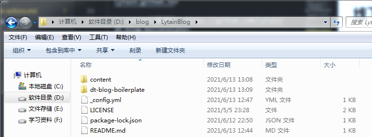
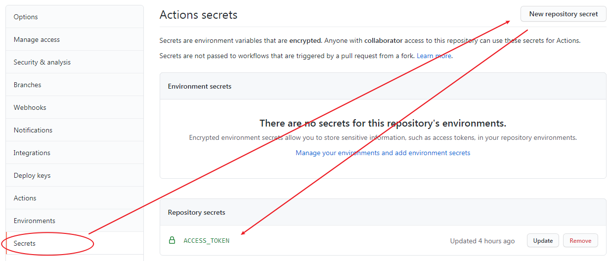
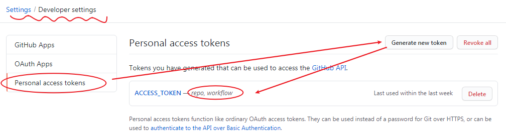
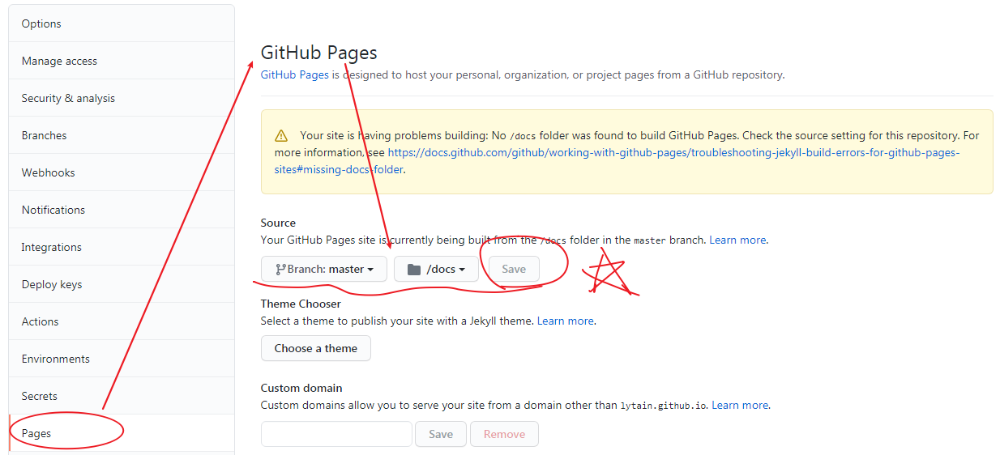
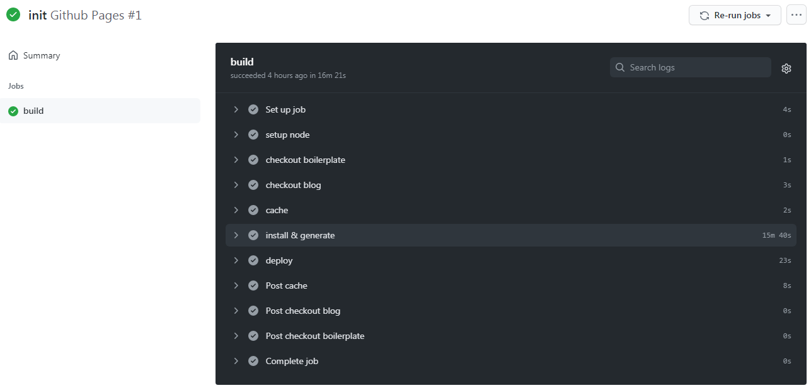

作者：Lytain

## 前言

这是本博客搭建时，所学习到的一些东西，我觉得是个很不错的尝试（在软件方面），因此记录以下，用以下次忘记时可以反复查看。

首先，如何搭建这个博客笔记网站，参考的来源是**DiscreteTom**博客，我只不过做了一个复现使用的工作，在此感谢作者。具体需要准备的东西在这：

  1. DiscreteTom博客链接：<https://discretetom.github.io>

  2. DiscreteTom博客源码：<https://github.com/DiscreteTom/discretetom.github.io>

  3. DiscreteTom主题源码：<https://github.com/DiscreteTom/dt-blog-boilerplate>

经过一些工作后，我得到自己复现后的博客链接，博客源码和主题源码，主题源码是直接fork来的，就没怎么改了。具体链接在这：

  1. Lytain博客链接：<https://Lytain.github.io>

  2. Lytain博客源码：<https://github.com/Lytain/Lytain.github.io>

  3. Lytain主题源码：<https://github.com/Lytain/dt-blog-boilerplate>

## 线下搭建 

### 一、材料准备

下载**discretetom**博客源码和**dt-blog-boilerplate**主题源码，稍作整理，放在自己的博客文件夹下。



### 二、安装运行

打开cmd，进入**dt-blog-boilerplate**文件夹下，运行npm install和npm run dev的指令，一段等待后，可以进入"http://localhost:3000"地址查看。

## 线上搭建

### 一、一些准备

1）新建一个repository，命名为**用户名.github.io**，这个需要开源public才能使用github-pages。

2）将主题源码fork到自己的github repository中去。

3）在博客源码处，需要配置secrets，才能使用github-actions。



具体配置的secrets值，得进入settings的Developer settings中按下面流程设置。



### 二、相关配置

1）.github\workflows\main.yml文件的配置。

```yml
name: Github Pages
on:
  push:
    branches:
      - source
jobs:
  build:
    runs-on: ubuntu-latest
    steps:
      - name: setup node
        uses: actions/setup-node@master

      - name: checkout boilerplate
        uses: actions/checkout@v2
        with:
          repository: Lytain/dt-blog-boilerplate
          path: boilerplateRepo
          persist-credentials: false

      - name: checkout blog
        uses: actions/checkout@v2
        with:
          ref: source
          path: contentRepo
          persist-credentials: false

      - name: cache
        id: cache
        uses: actions/cache@v1
        with:
          path: ~/.npm
          key: ${{ runner.os }}-node-${{ hashFiles('**/package-lock.json') }}
          restore-keys: |
            ${{ runner.os }}-node-

      - name: install & generate
        run: |
          cp -r contentRepo/* boilerplateRepo
          cd boilerplateRepo/dt-blog-boilerplate
          npm install
          npm run generate

      - name: deploy
        uses: peaceiris/actions-gh-pages@v3
        with:
          personal_token: ${{ secrets.ACCESS_TOKEN }}
          publish_branch: master
          publish_dir: boilerplateRepo/dt-blog-boilerplate/dist

```

具体需要把主题源码放到source分支，把主题相关文件放到master分支上。

2）在主题源码下，打开git bash中使用下面指令，把源码push到主题源码中去。

```git
git init
git add .
git commit -m "init"
git branch -M source
git remote add origin https://github.com/Lytain/Lytain.github.io.git
git push -u origin source
```

3）同样，把master分支下的代码也传上去。

```git
git init
git add .
git commit -m "init"
git branch -M master
git remote add origin https://github.com/Lytain/Lytain.github.io.git
git push -u origin master
```

4）配置好github-pages，这点很重要，不然一直显示不了。



### 三、在actions等待部署

actions会执行yml文件相关的配置，等待配置完，可以得到下面的结果，再输入网站地址，就可以查看对应的效果了。



## 补充

OK，稍微整理了下，可以作为一个github学习的小实验。但关于github-actions相关的东西，还是需要后面在学习下。

- [GitHub Actions 入门教程(阮一峰)](http://www.ruanyifeng.com/blog/2019/09/getting-started-with-github-actions.html)
- [Git：将已有的项目添加到github](https://www.jianshu.com/p/6f3324e4f335)
- [GitHub Actions 的工作流程语法](https://docs.github.com/cn/actions/reference/workflow-syntax-for-github-actions)
- [使用 GitHub Actions 实现博客自动化部署](https://frostming.com/2020/04-26/github-actions-deploy/)
