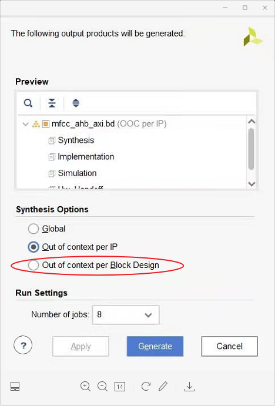
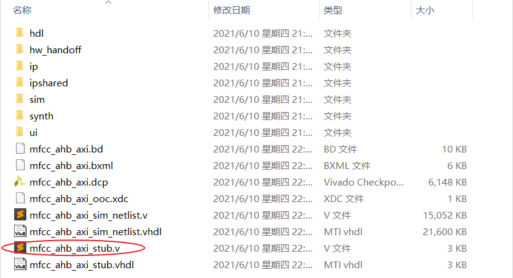
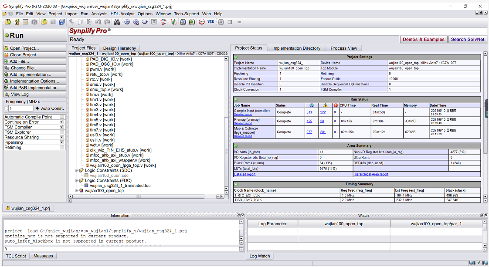
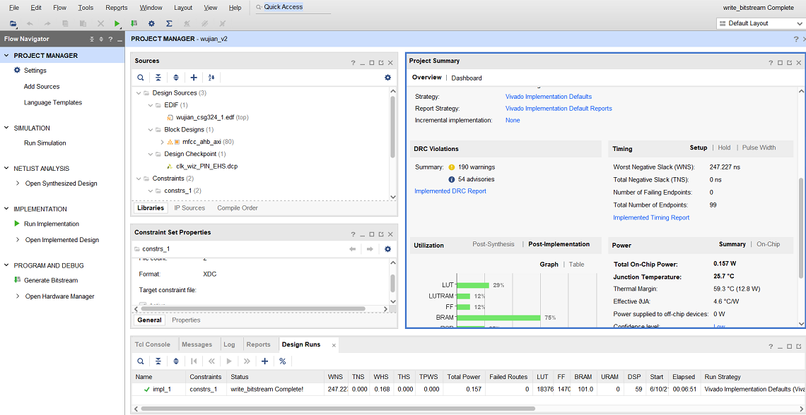

作者：Lytain

## 引子

在大型项目下，单纯使用Vivado来综合并实现bitstream的方式，效率非常低。为此，参照官方手册，可以使用第三方工具来加速一些编译的过程。

这里，提出一种**vivado+synplify**的黑匣子方式，来加速得到bitstream。这个思路来源于同队的海哥，感谢一波。这里加以记录下。

需说明的是，这种方式适合具有**Verilog源码+BlockDesign**的方式，单纯只有BD的话，效率上并没有提高多少，或者说基本是一样的。因为，synplify加速的基本就是Verilog纯源码的部分。

## 步骤

### 一、新建一个vivado prj

这个新建的vivado工程，用于导入设计中的Verilog源码、并添加新设计的BlockDesign，并使用**Out of context per IP**的方式，来综合新加入的BlockDesign IP。

这种方式下，可以得到BlockDesign IP的stub文件，这个文件就是黑匣子文件，用于添加到synplify的工程中。

### 二、新建一个synplify prj

这个新建的synplify工程，用于导入所有的Verilog源码和stub.v的黑匣子文件。配置好synplify的时钟约束、目标板卡和顶层Top后，进行编译综合，synplify速度还是挺快的，综合后得到网表文件，这个网表文件后续用于导入新建的另一个vivado工程中去。

### 三、再建一个vivado prj

这个新建的vivado工程，是用于导入网表的，在这个工程中，把第二步中synplify得到的网表导入，再把自己设计的BlockDesign的bd文件，作为DesignSource导入。如果使用了Xilinx自带的一些IP，还需要把相应IP的dcp文件导入。

Ok，这样子，再建一个vivado prj的工作已经接近尾声，把管脚约束、时序约束（如果有）放进来，就可以进行vivado这边的实现了，实现完生成bitstream即可。

## 其他

关于vivado联合第三方的综合工具的更多信息，可以查看下面的一些材料，我具体这部分的学习，是使用**wujian100**+**mfcc ip**+**kws ip**时学习的。

- c_ug896-vivado-ip_采用IP设计
