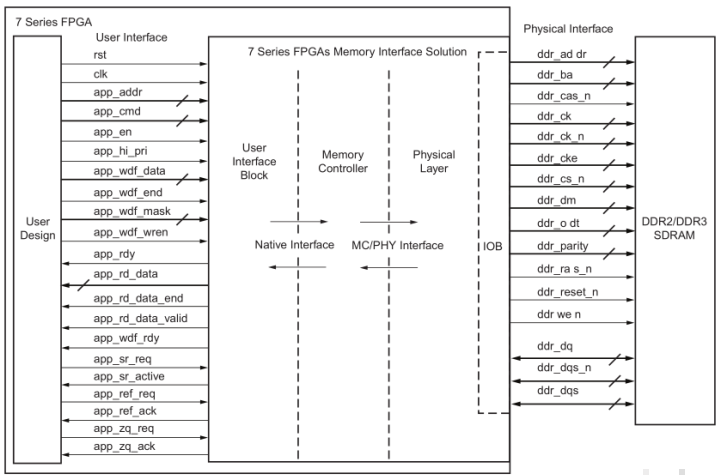
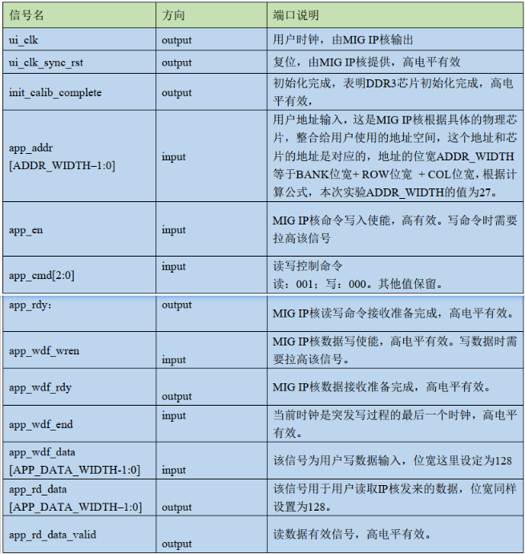
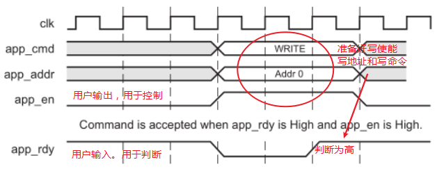
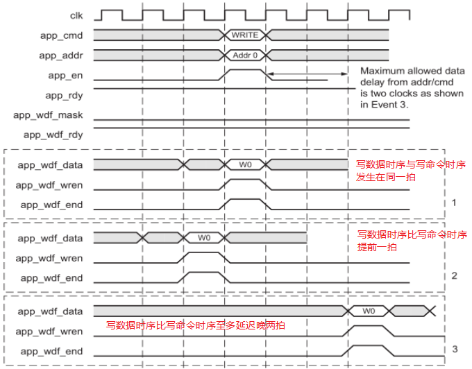
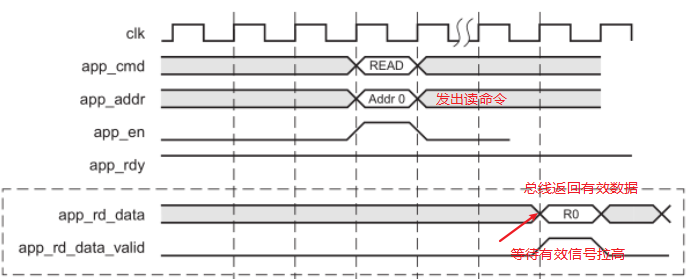

作者：Lytain

## 概念

---
DDR3 芯片为南亚的 NT5CC128M16IP-DI，bank 位宽为 3，行
位宽为 14，列位宽为 10，故地址大小为：
$$
2^{3} \times 2^{14}  \times 2^{10}= 2^{27}
$$
数据位宽为16bit，所以容量大小为 128M*16bit，即 256MByte。

---
左侧为用户接口（FPGA 与 MIG 交互接口），只有充分掌握了这些接口才能操作 MIG。右侧为 DDR 物理芯片接口，负责产生具体的操作时序，并直接操作芯片管脚。这一侧用户只负责分配正确的管脚，其他不用关心。

---

MIG IP 核用户侧端口数量共 26 个，只需了解本实验要用到几组重要信号。表格中的信号方向定义为输出， 那么相对于用户端来说实际上是输入。

## 时序

DDR3 的读或者写都包含**写命令操作**，写操作命令 app_cmd 的值为 0，读操作 app_cmd 的值为 1。

### 一、写命令时序

首先，检查 app_rdy，为高则表明此时 IP 核命令接收处于准备好状态，可以接收用户命令。

在当前时钟拉高 app_en，同时发送命令 app_cmd 和地址 app_addr，此时命令和地址被写入。

### 二、写数据时序

首先，需要检查 app_wdf_rdy，该信号为高表明此时 IP 核数据接收处于准备完成状态，可以接收用户发过来的数据，在当前时钟拉高写使能 app_wdf_wren，给出写数据 app_wdf_data。加上发起的写命令操作就可以成功向 IP 核写数据。

这里有一个信号 app_wdf_mask，是用来屏蔽写入数据的，该信号为高则屏蔽相应的字节，该信号为 0 默认不屏蔽任何字节。

另外，DDR3 的读或者写操作都可以分为背靠背和非背靠背两种情形。背靠背，即读或者写每个时钟都连续进行，中间没有间隙。非背靠背写则是非连续的读写。

### 三、读数据时序

## 参考

- [markdown在线学习](https://markdown.lovejade.cn)
- [LaTeX在线编辑站点](https://www.latexlive.com)
