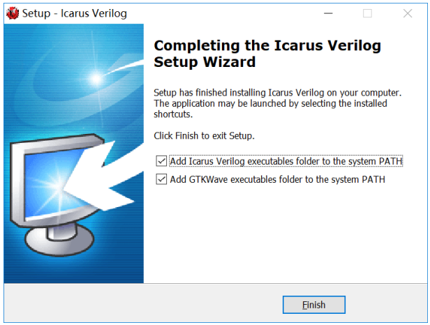
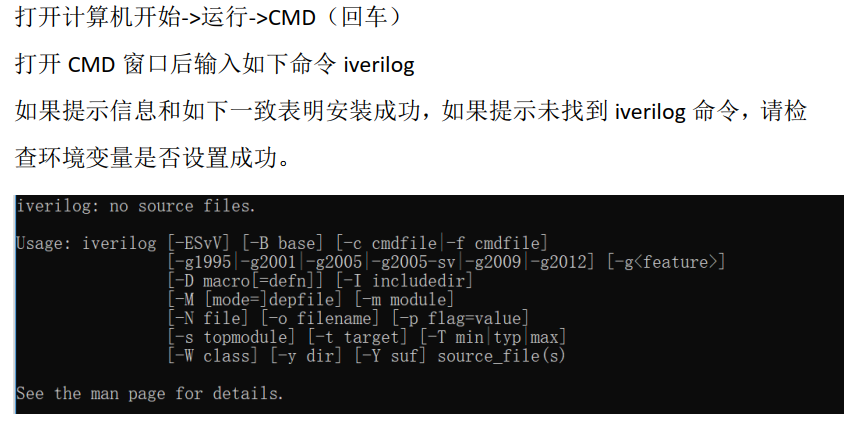
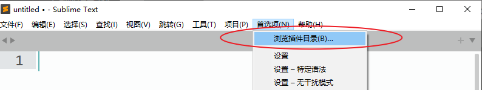
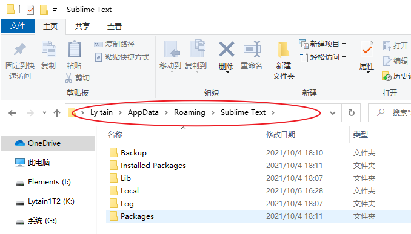
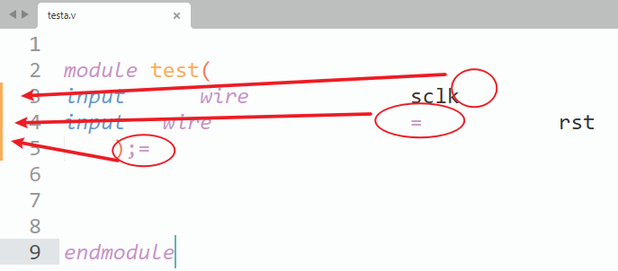
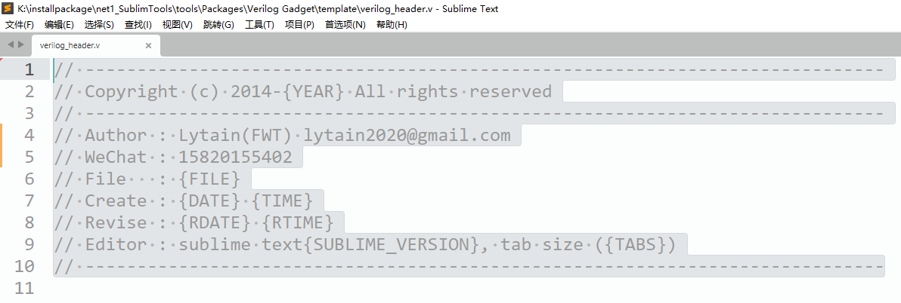
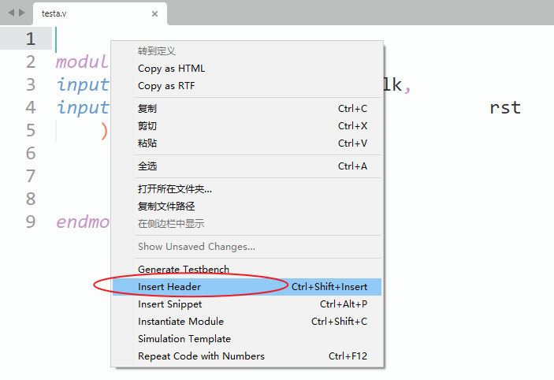
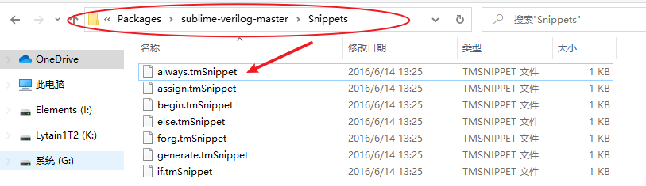
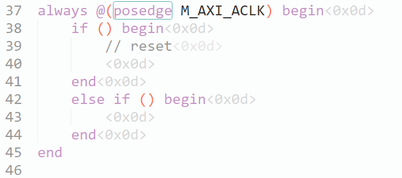
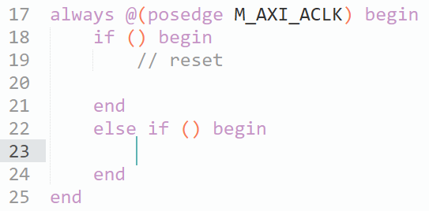

作者：Lytain

## 目的

为加速硬件描述语言的代码开发，开始了基于Sublime的一些搭建工作，后续更新内容将于此贴。

搭建说明：

1、Verilog语法检测。

资源准备：

1. Sublime安装包。[sublime_text_build_4113_x64_setup.exe](https://lytain.lanzoui.com/i58UWuzc5he)
2. Sublime破解编辑网站。[hexed](https://hexed.it/)
3. Verilog语法检测软件。[iverilog-10.1.1-x64_setup.exe](https://lytain.lanzoui.com/iItU0uzcs6b)
4. 支持性插件包。[V1版本](https://lytain.lanzoui.com/idwZ8uzd95c)
5. Lytain插件包。[V2版本，还没有更新]()

## Sublime破解

1）在软件的安装目录找到 sublime_text.exe 文件。

2）使用hexed在线十六进制编辑器，打开 sublime_text.exe 文件。

3）然后查找以下字节并且替换（不同的软件版本替换的内容略有不同，一定要看好软件版本）。

```
80 38 00 74 2C 49 替换为 FE 00 90 74 2C 49
```

## iverilog安装

傻瓜式安装，最后一步需要注意勾选上自动添加环境变量的操作。如果没有的话需要手动添加。



如果手动添加环境变量的话，我的添加路径是下面这个。个人的会有不同。

```
D:\iverilog\bin
D:\iverilog\gtkwave\bin
```

测试是否安装成功，可以参照下面的这个方法。



## 插件包使用

解压插件包，可以得到下面的文件夹。


进入Sublime后（我这个已经弄完，所以中文），点击首选项——>浏览插件目录，可以打开一个路径。



在这个路径下，回到上一级，在上一级中用分享的文件，进行覆盖。



打开一个.v结尾的文件，如果verilog语法出错，会出现左边的红色提示条，需要进行更改。到这里，基本上iverilog和sublime的安装都没什么问题了。



## 效率提高1——头快速加入

在下面路径的template文件夹下，有一个verilog_header.v文件，打开这个文件，可以修改自己的一些基本信息。

```
C:\Users\23133\AppData\Roaming\Sublime Text\Packages\Verilog Gadget\template
```

这里我修改个人信息，再把文件设置为只读。



在.v文件中右键，有一个Insert Header，可以方便地插入头信息。



## 效率提高2——语法模板

在我的这个路径下，有一个Snippets文件，可以从这里面拷一个模板，来进行修改。

```
C:\Users\23133\AppData\Roaming\Sublime Text\Packages\sublime-verilog-master\Snippets
```

我拷贝的模板是always.tmSnippet，具体内容如下。

```
<?xml version="1.0" encoding="UTF-8"?>
<!DOCTYPE plist PUBLIC "-//Apple//DTD PLIST 1.0//EN" "http://www.apple.com/DTDs/PropertyList-1.0.dtd">
<plist version="1.0">
<dict>
	<key>content</key>
	<string>always @(posedge clk or ${1:posedge} ${2:rst}) begin
	if ($2) begin
		// reset
		$3
	end
	else if ($4) begin
		$0
	end
end</string>
	<key>name</key>
	<string>always</string>
	<key>scope</key>
	<string>source.verilog</string>
	<key>tabTrigger</key>
	<string>always</string>
	<key>uuid</key>
	<string>026B3DA6-E1B4-4F09-B7B6-9485ADEF34DC</string>
</dict>
</plist>
```

我对这个模板进行一些修改，比如改成一个master axi时序逻辑赋值模板，文件命名为cmaxialways.tmSnippet。并把文件放在新建的\Packages\Lytain文件夹下，后续自己添加的语法也放这里面。

```
C:\Users\23133\AppData\Roaming\Sublime Text\Packages\Lytain
```



修改其中内容，得到下面的一个模板。

```
<?xml version="1.0" encoding="UTF-8"?>
<!DOCTYPE plist PUBLIC "-//Apple//DTD PLIST 1.0//EN" "http://www.apple.com/DTDs/PropertyList-1.0.dtd">
<plist version="1.0">
<dict>
	<key>content</key>
	<string>always @(posedge M_AXI_ACLK) begin
	if ($1) begin
		// reset
		$2
	end
	else if ($3) begin
		$4
	end
end</string>
	<key>name</key>
	<string>cmaxialways</string>
	<key>scope</key>
	<string>source.verilog</string>
	<key>tabTrigger</key>
	<string>cmaxialways</string>
	<key>uuid</key>
	<string>026B3DA6-E1B4-4F09-B7B6-9485ADEF34DC</string>
</dict>
</plist>
```
理论上已经行了，但实际上，效果一直不好，是下面这个样子的。



后来发现，tmSnippet后缀形式的文件，其实是不太行的，需要改成sublime-snippet后缀形式，并把内容改为下面这样。

```
<snippet>
<content><![CDATA[
always @(posedge M_AXI_ACLK) begin
	if ($1) begin
		// reset
		$2
	end
	else if ($3) begin
		$4
	end
end
]]></content>

<tabTrigger>c_maxialways</tabTrigger>
<scope>source.verilog</scope>

</snippet>
```

最后的效果如下：



## 效率提高3——进制文件

我后面继续来补坑

## 时间记录

- 2021年10月06日：整理各种东西，补上效率提高1和2。
