## 版本要求

Win10系统硬性要求：内部版本19041或更高版本。

查询方式：Win+R，输入winver。这里我的是19043，可以接受。如果版本太低，建议直接重新刷机，直接解放一波空间。

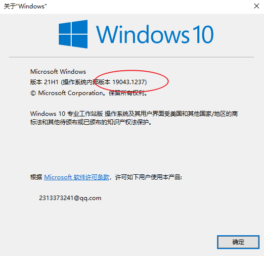

## WSL的安装

1、使用管理员权限打开powershell。

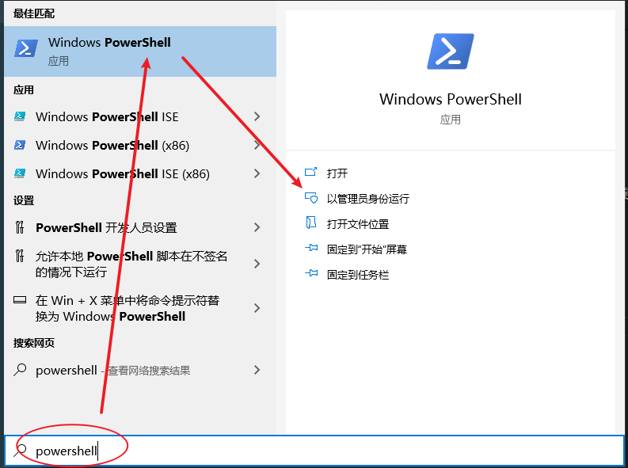

2、启用“适用于 Linux 的 Windows 子系统”可选功能，输入下面代码。这时候wsl其实已经启用了，由于后面要更新到wsl2，就在后面一起重启。

```
dism.exe /online /enable-feature /featurename:Microsoft-Windows-Subsystem-Linux /all /norestart
```

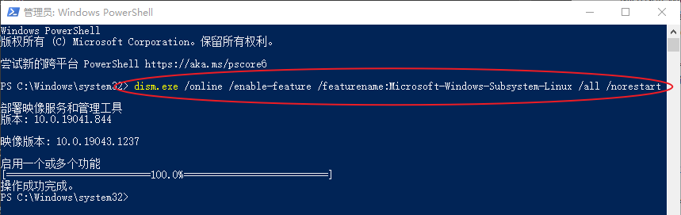

3、升级到WSL2。启用“虚拟机平台”可选组件，输入下面代码。

```
dism.exe /online /enable-feature /featurename:VirtualMachinePlatform /all /norestart
```

4、重启电脑。重新管理员身份打开powershell，用下面的命令将wsl2设置为默认。

```
wsl --set-default-version 2
```

中途可能出现“请启用虚拟机平台 Windows 功能并确保在 BIOS 中启用虚拟化”的错误。


需要管理员运行命令行程序，然后输入下面指令：

```
bcdedit /set hypervisorlaunchtype auto
```

输入返回成功信息后，再次重启，然后输入重新执行4的步骤，最后出现下面这图，说明启用了wsl2。

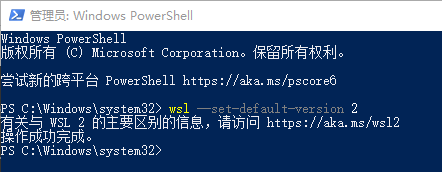

## 安装Linux

打开 [Microsoft Store](https://aka.ms/wslstore)，并选择你偏好的 Linux 分发版。可以从下面准备的链接进去。分发版的话，直接点击链接获取安装即可。

- [Ubuntu 16.04 LTS](https://www.microsoft.com/store/apps/9pjn388hp8c9)
- [Ubuntu 18.04 LTS](https://www.microsoft.com/store/apps/9N9TNGVNDL3Q)
- [Ubuntu 20.04 LTS](https://www.microsoft.com/store/apps/9n6svws3rx71)
- [openSUSE Leap 15.1](https://www.microsoft.com/store/apps/9NJFZK00FGKV)
- [SUSE Linux Enterprise Server 12 SP5](https://www.microsoft.com/store/apps/9MZ3D1TRP8T1)
- [SUSE Linux Enterprise Server 15 SP1](https://www.microsoft.com/store/apps/9PN498VPMF3Z)
- [Kali Linux](https://www.microsoft.com/store/apps/9PKR34TNCV07)
- [Debian GNU/Linux](https://www.microsoft.com/store/apps/9MSVKQC78PK6)
- [Fedora Remix for WSL](https://www.microsoft.com/store/apps/9n6gdm4k2hnc)
- [Pengwin](https://www.microsoft.com/store/apps/9NV1GV1PXZ6P)
- [Pengwin Enterprise](https://www.microsoft.com/store/apps/9N8LP0X93VCP)
- [Alpine WSL](https://www.microsoft.com/store/apps/9p804crf0395)

初次启动它会进行一个初始化的过程，需要等待一段时间。完成之后会让你设置账号和密码。

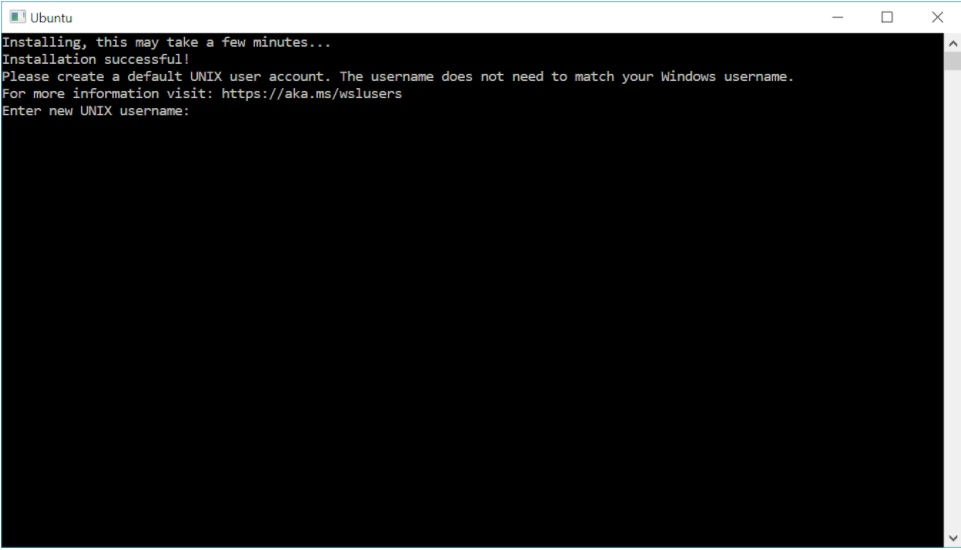

但，装分发版有个不好的点，就是默认装在C盘了，额如果此时已经装了分发版到C盘，可以使用下面的方法，尝试转换盘符。

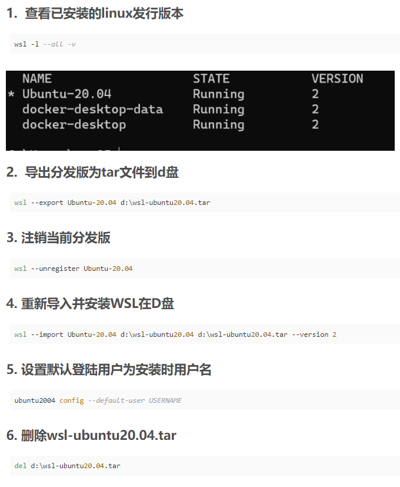

涉及的命令记录如下：（方便复制）

```
wsl -l --all -v
wsl --export Ubuntu-20.04 d:\wsl-ubuntu20.04.tar
wsl --unregister Ubuntu-20.04
wsl --import Ubuntu-20.04 d:\wsl-ubuntu20.04 d:\wsl-ubuntu20.04.tar --version 2
ubuntu2004 config --default-user USERNAME
del d:\wsl-ubuntu20.04.tar
```

## 安装Linux（发行版）

如果一开始就不打算装C盘，可以参考[微软教程](https://docs.microsoft.com/zh-cn/windows/wsl/install-manual)安装发行版。

链接如下：

- [Ubuntu 20.04](https://aka.ms/wslubuntu2004)
- [Ubuntu 20.04 ARM](https://aka.ms/wslubuntu2004arm)
- [Ubuntu 18.04](https://aka.ms/wsl-ubuntu-1804)
- [Ubuntu 18.04 ARM](https://aka.ms/wsl-ubuntu-1804-arm)
- [Ubuntu 16.04](https://aka.ms/wsl-ubuntu-1604)
- [Debian GNU/Linux](https://aka.ms/wsl-debian-gnulinux)
- [Kali Linux](https://aka.ms/wsl-kali-linux-new)
- [SUSE Linux Enterprise Server 12](https://aka.ms/wsl-sles-12)
- [SUSE Linux Enterprise Server 15 SP2](https://aka.ms/wsl-SUSELinuxEnterpriseServer15SP2)
- [openSUSE Leap 15.2](https://aka.ms/wsl-opensuseleap15-2)
- [Fedora Remix for WSL](https://github.com/WhitewaterFoundry/WSLFedoraRemix/releases/)

这里我下载Ubuntu 20.04发行版，来进行安装。下载后可以得到一个后缀名为.appx的文件。

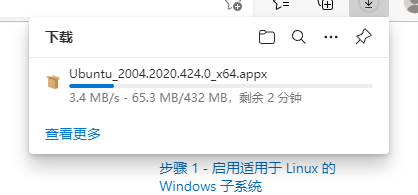

把它的后缀改为.zip，然后解压到想要安装WSL的目录下，我们可以得到一些文件。


这里，我把这个压缩包解压的文件，放到E:\SW_Wsl2_Linux\Ubuntu2004路径下，后面双击ubuntu2004.exe文件就可以安装到当前的目录下。

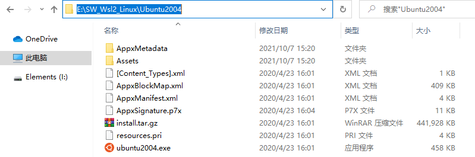

但在双击前，需要注意的是安装目录的磁盘不能开压缩内容以便节省磁盘空间选项，否则会报错0xc03a001a。可以右键文件夹-->属性-->常规-->高级找到并关闭这个选项。

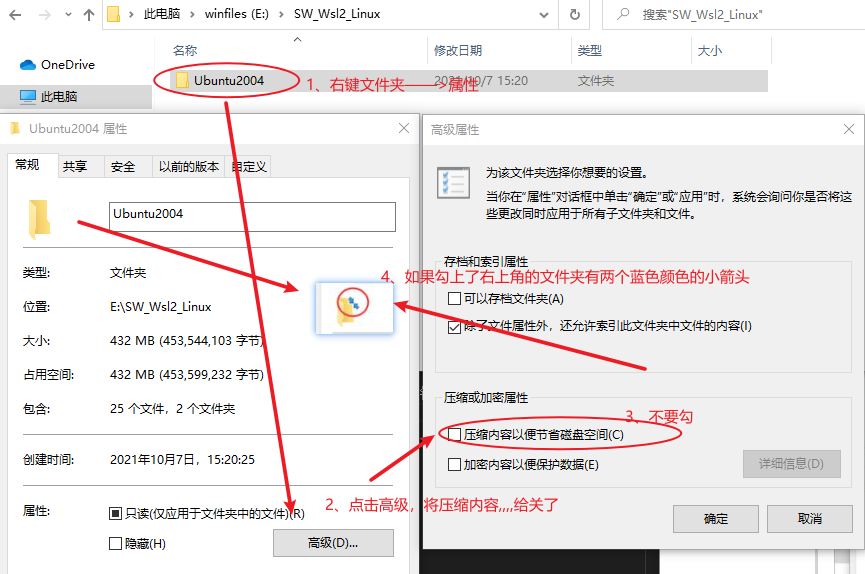

另外，可能出现“WslRegisterDistribution failed with error: 0x800701bc”的问题。

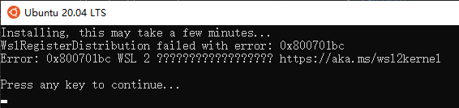

造成该问题的原因是WSL版本由原来的WSL1升级到WSL2后，内核没有升级，前往微软WSL官网下载安装适用于 x64 计算机的最新 WSL2 Linux 内核更新包即可。附上[下载链接](https://wslstorestorage.blob.core.windows.net/wslblob/wsl_update_x64.msi)。双击即可安装，下图是一个安装成功后的界面。

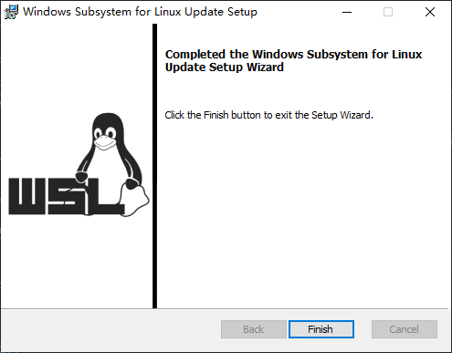

OK，接下来双击ubuntu2004.exe图标，开始进行安装，安装时会等待一分多钟。

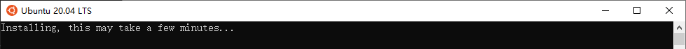

等待一段时间后，安装完成需要输入用户信息和密码，这里直接lytain+我的密码...

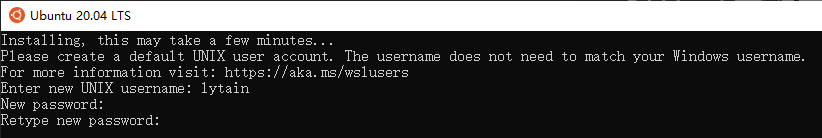

设置完后，直接安装成功，最终打印信息如下。

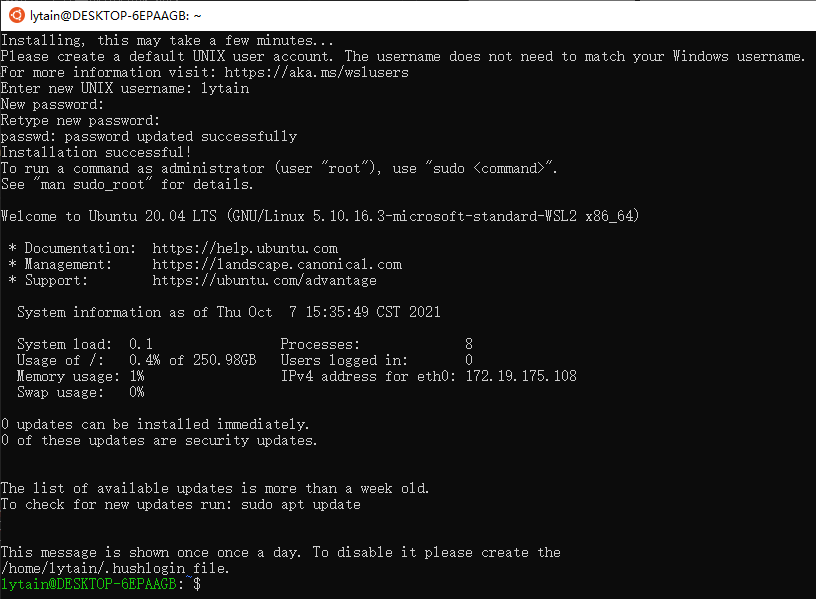

## WSL技能1——定位安装位置

前提：安装Everything，这是一个很小的软件...

思路：在wsl环境下，新建一个文件，用everything进行搜索，确定文件的路径。

测试：如果不是默认装C盘，这个文件定位的方法，貌似不行。

## WSL命令整理

1、查看已安装的linux发行版本。

```
wsl -l --all -v
```

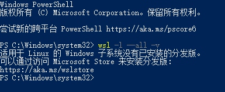

## 参考文章

- [win10 wsl2修改默认安装目录到其他盘](https://blog.csdn.net/w851685279/article/details/108904106)
- [旧版 WSL 的手动安装步骤](https://docs.microsoft.com/zh-cn/windows/wsl/install-manual)
- [自定义WSL的安装位置，别再装到C盘啦](https://zhuanlan.zhihu.com/p/263089007)
- [win10 WSL2问题解决WslRegisterDistribution failed with error: 0x800701bc](https://blog.csdn.net/qq_18625805/article/details/109732122)
- [找出你的windows子系统(WSL)的安装位置](https://blog.csdn.net/qq_38730945/article/details/82938403)
- [WSL2的安装详细过程](https://blog.csdn.net/huiruwei1020/article/details/107551106)

## 时间记录

- 2021年10月07日：一路弄到WSL命令整理。先这样吧，后面有学到新东西，就继续加进去。
