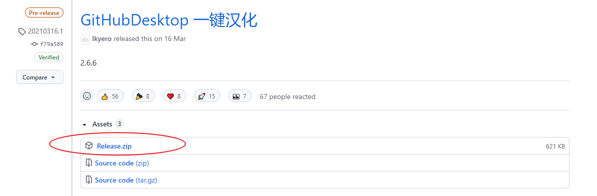
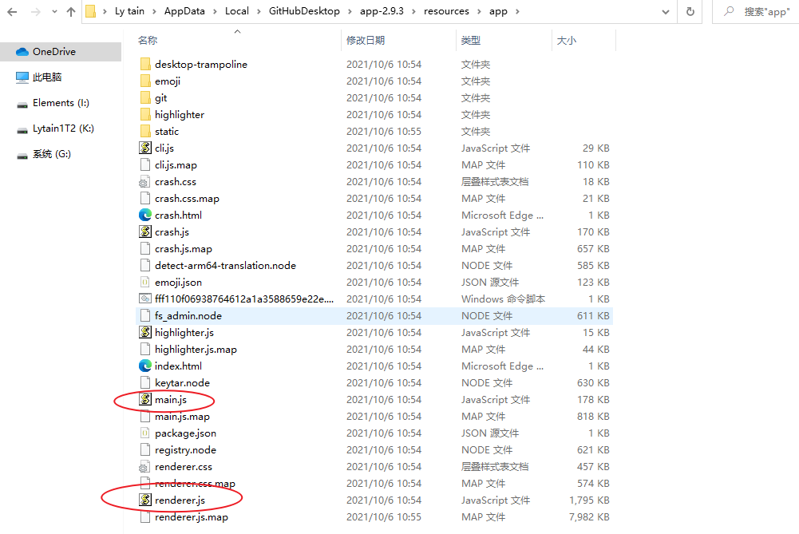
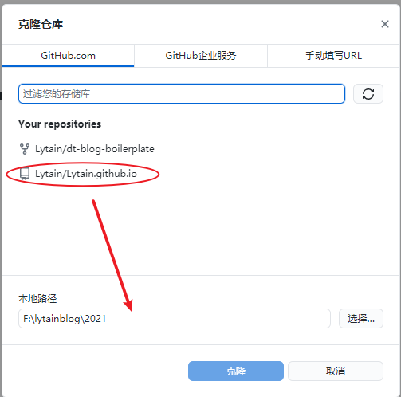
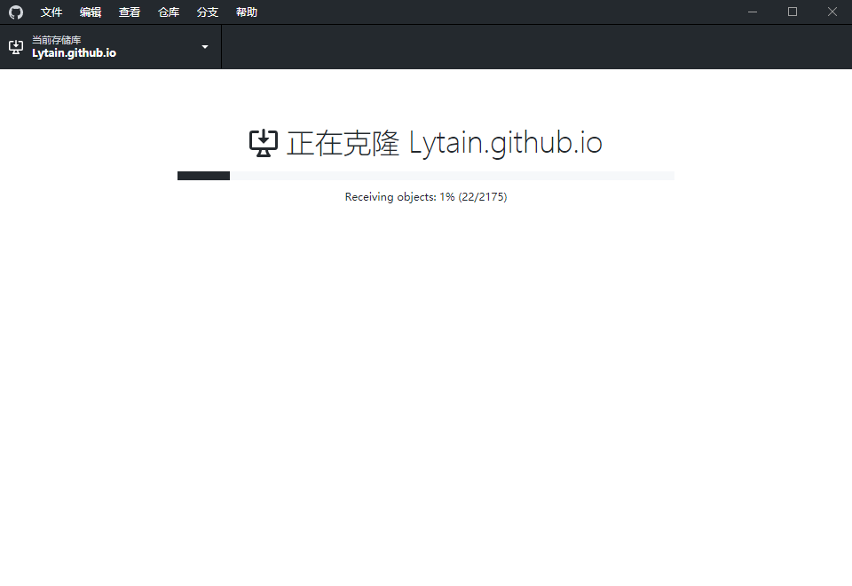
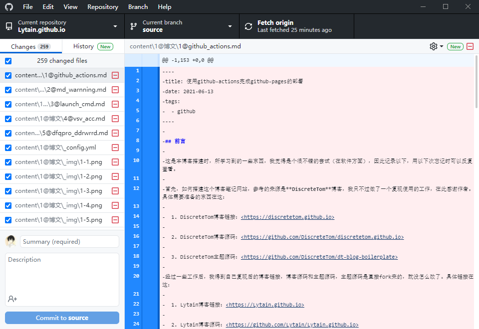
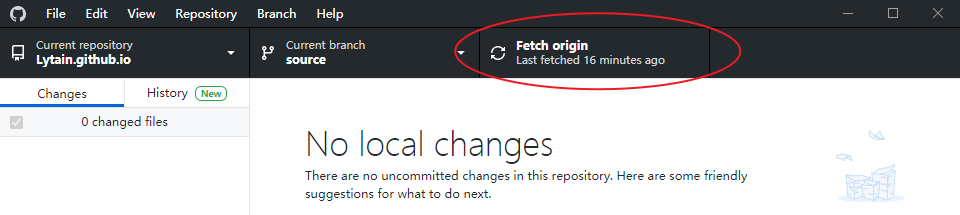

## 安装gitDesktop版本

下载地址：https://desktop.github.com/

## 进行中文版的汉化

下载中文汉化所需文件：https://github.com/lkyero/GitHubDesktop_zh/releases

将main.js和rendered.js文件放到下面的路径下。C:\Users\23133\AppData\Local\GitHubDesktop\app-2.9.3\resources\app

## 克隆仓库下来

填入需要从线上clone的repository的名称以及即将存入本地的路径，这里选择F盘下的lytainblog\2021文件夹。

点击克隆后，会进行克隆操作。

克隆后的repository图下面所示，用vscode打开repository后，编辑这个工程可以实时的更新对应的输出。

push到github网页上。然后可以打开repository查看下是否更新了，另外，也会自动actions，actions后才可以看到网址更新的内容。

