---

title: 基于Artix7的DDR3 SDRAM IP核调取
date: 2021-06-14
tag:
    - FPGA
---

## 引言

基础课中，学习了 SDRAM 控制器的设计，纯 Verilog 方式书写比较麻烦。因此，考虑使用 Xilinx 在一些 FPGA 中已集成的 IP 核，来控制这些 SDRAM，故熟悉此类IP核的**调取**与**使用**是非常有必要的。高级课程中，偏向使用例化而不用 BlockDesign 的方式进行设计。

使用板卡：v3学院 EagleGT_REV10 开发板。

使用软件：Vivado2019.2。

## 调取流程

### 一、新建工程

没有将所有的图放上来。可以将子目录给取消掉。

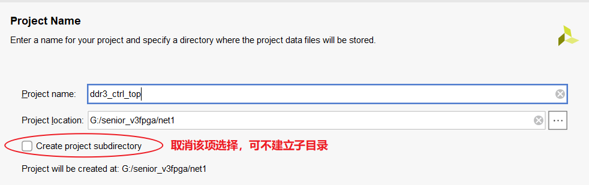

芯片型号，选择 xc7a75tfgg484-2，这是自己板卡上FPGA的型号。

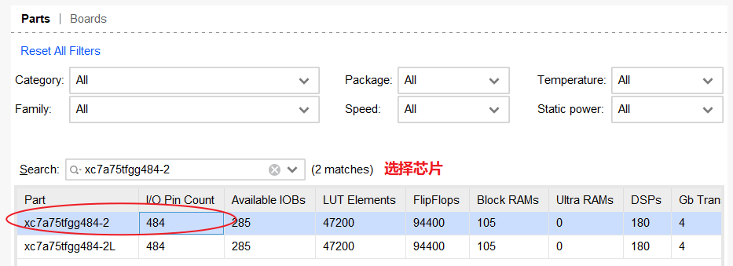

### 二、IP核添加

打开 IP Catalog，输入 memory interface，找到 Memory Interface Generator这个 IP，进入到核调取页面。这个 IP 其实是软核，即使用 FPGA 的逻辑加上 HR 的一些高速 Bank （最高支持的频率可以用来支持）共同实现的。

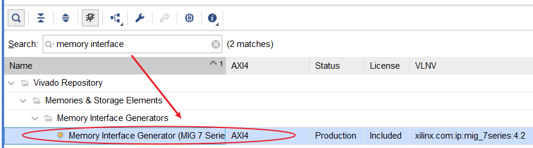

双击 IP 核名称打开 DDR3 SDRAM IP 核调取界面，该界面中主要是总结了所选芯片的型号等，如果有错误，可以关闭重新click再看看。

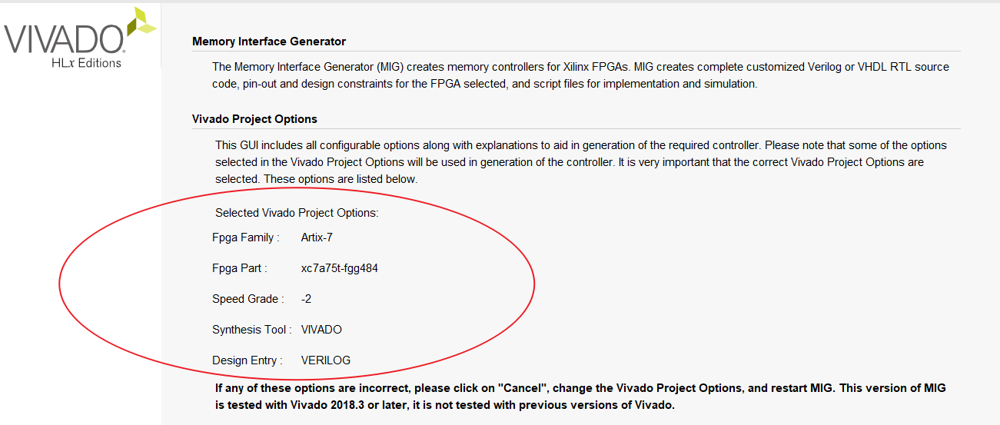

点击 Next，可按照个人喜好定义器件的名称，也可以选择 DDR3 控制器的个数，我们的器件名为默认，控制器的数量为 1 个。目前这个芯片可以支持 2 个，但板子上只连接了一个，多个控制器的连接，可以使用乒乓操作，来增加吞吐量。

这里没有使用 AXI 的接口进行控制，后面可以使用 AXI 进行相关的设计。

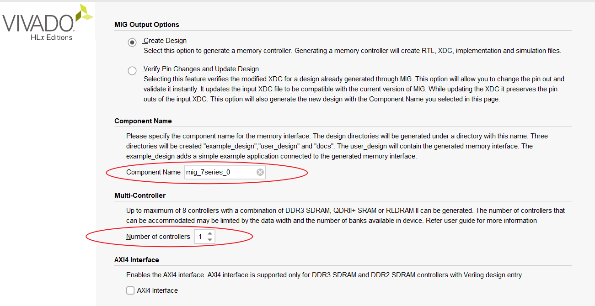

点击 Next，如果使用的芯片相同，则可以选择，若没有，可以不选。

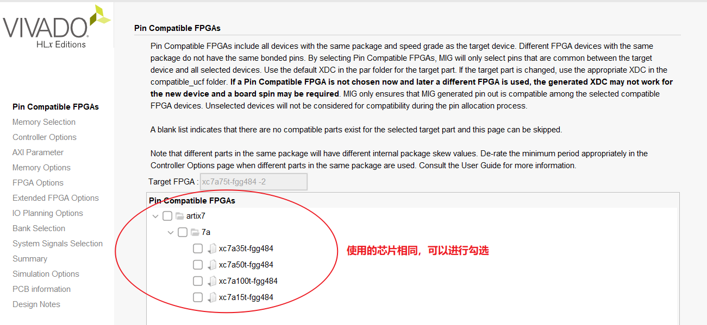

继续点击下一步，进入到选取控制器类型的界面，在此我们选择 DDR3，所示使用的为其他类型的 SDRAM，则可以按照需求选择。

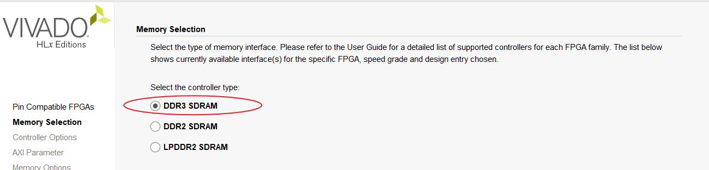

点击 Next，进入到选取 DDR3 SDRAM 相应参数的界面，在此我们要选择 DDR3 的工作频率（同步时钟），在此我们设置为 400MHz，若是 FPGA 芯片速度等级不同，则可能该工作频率的范围不一样。

DDR 的工作为800 MHz，是由这里的工作时钟决定的，这里选择400 MHz，双沿下就是800 MHz了。允许的范围是2500 - 3300。PHY 与 CCR 的时钟比，可以是4:1和2:1的模式。PHY 就是这里的 400 MHz，则控制器时钟为100 MHz。

这里，衍生出如何计算 DDR 的带宽。400x2x16=12.8Gbps。由于 DDR 控制器是半双工的，如果考虑读写的情况，平均分配的话，每个操作占有6.4Gbps的理论。

- 400是控制器PHY的时钟，2是 DDR 双沿采样，16是16bit bus的位宽。
- 只是理论带宽，实际上可能达不到，因为SDRAM的刷新，激活，写等都需要占时钟周期，如果访问的数据不是很连续，反复激活切换 Bank，会降低效率。因此，实际上，会将理论带宽x0.8，来估计实际上的带宽。

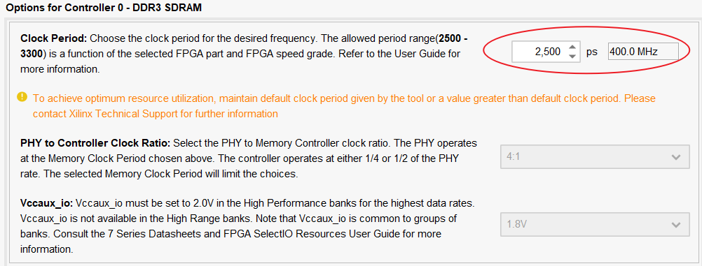

选择 DDR3 SDRAM 的芯片类型（参数选择最接近的），此处需要根据开发板上的芯片类型来选择，若是列表内没有相应的芯片类型，可以在 Create Custom Part 中根据 DDR3 芯片参数来设定。DDR3 SDRAM 供电电压选择 1.35V（与原理图上的相对应），DDR3 SDRAM 数据总线位宽为16，ordering选择 normal 模式。

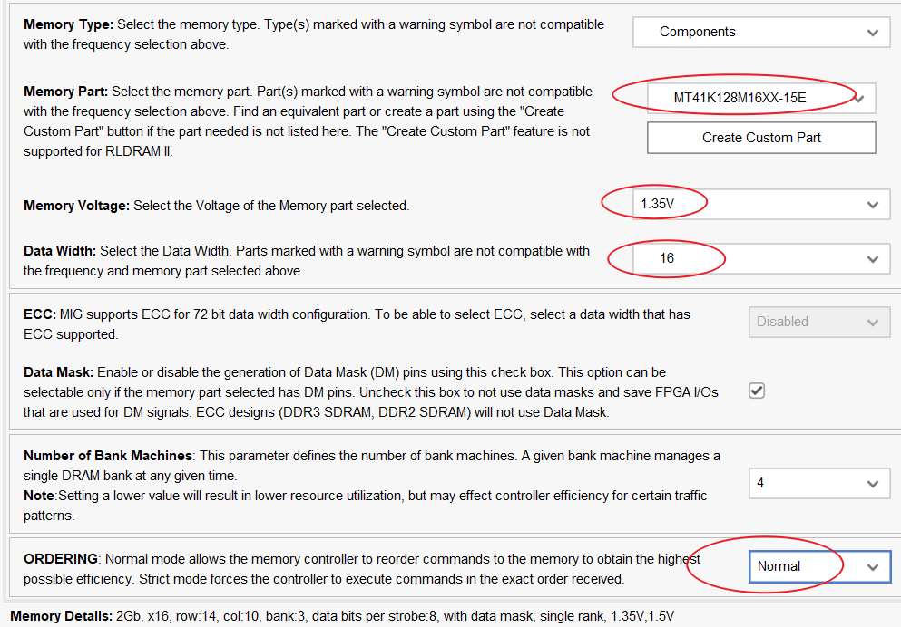

点击 Next，设定 DDR3 控制器的参数。在此设定该控制器的输入时钟频率为 200MHz（这个不同于 PHY 的时钟，是输入后 PPL 进行倍频的），控制器的突发类型为顺序性，其他默认即可。

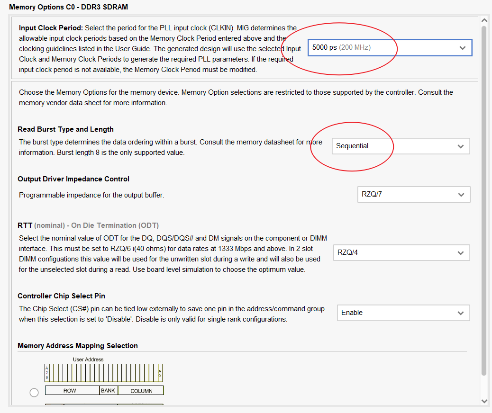

点击 Next，可以设定系统时钟和参考时钟，其中系统时钟有 single_ended、deferential 和 no buffer 三种，single_ended 为来源于引脚的单端时钟，deferential 为差分时钟，no buffer 为来源于 FPGA 内部的时钟。

参考时钟有四种，其中三种也为 single_ended（板子上是这个）、deferential（芯片内部无法产生差分时钟，只可能来源于 input） 和 no buffer，另外一种为 use system clock，只有在 system clock 时钟频率为 199MHZ~201MHz 时， 参考时钟才存在 use system clock 选项。

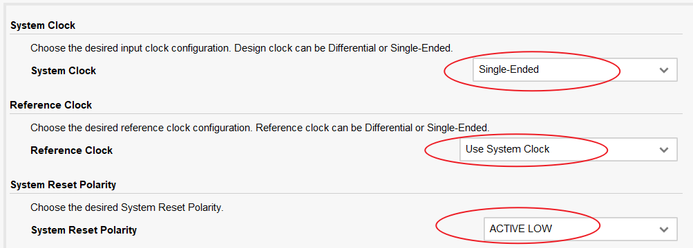

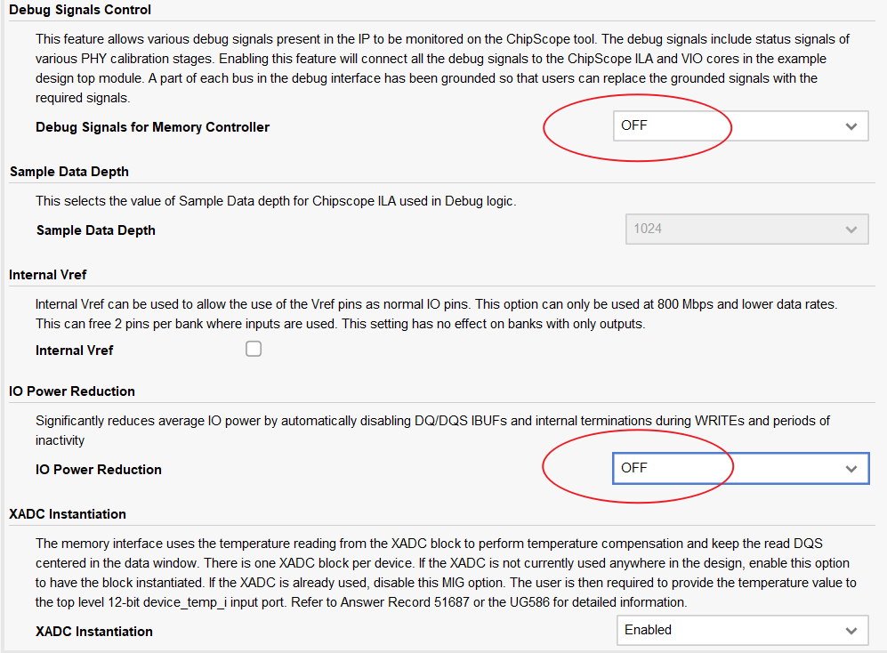

点击 Next 可以进入到设定内部终端电阻的界面，此处可以根据 DDR3 SDRAM 芯片手册选择，其实默认问题也不大的。

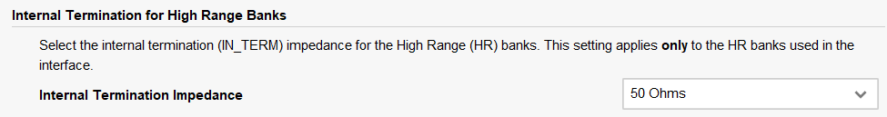

点击 Next，建议勾选第二项，在此可以直接导入 DDR3 SDRAM 的引脚信息，前提是引脚约束文件已经存在，引脚约束文件可以是 UCF 和 XDC 类型。

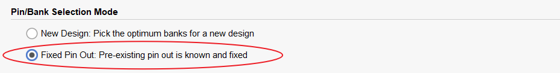

点击 Next，导入相应的约束文件。并进行相应的验证，才能点击Next到下一步。

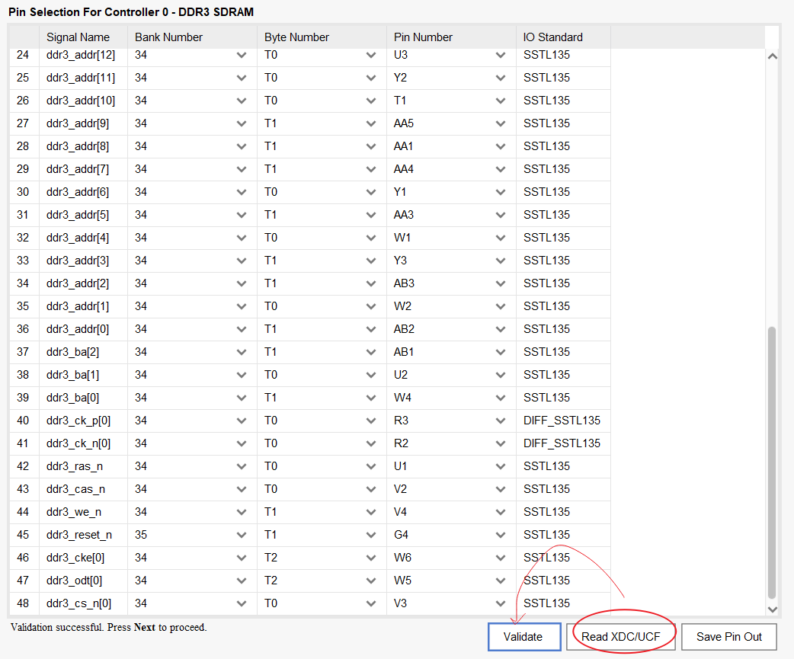

一路点击 Next，直到 Generator 来生成 DDR3 IP。

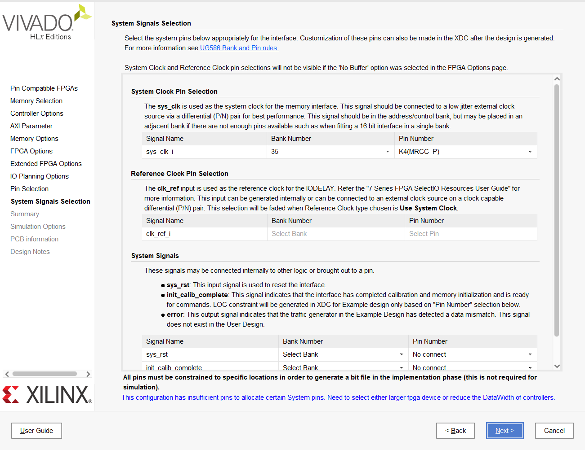

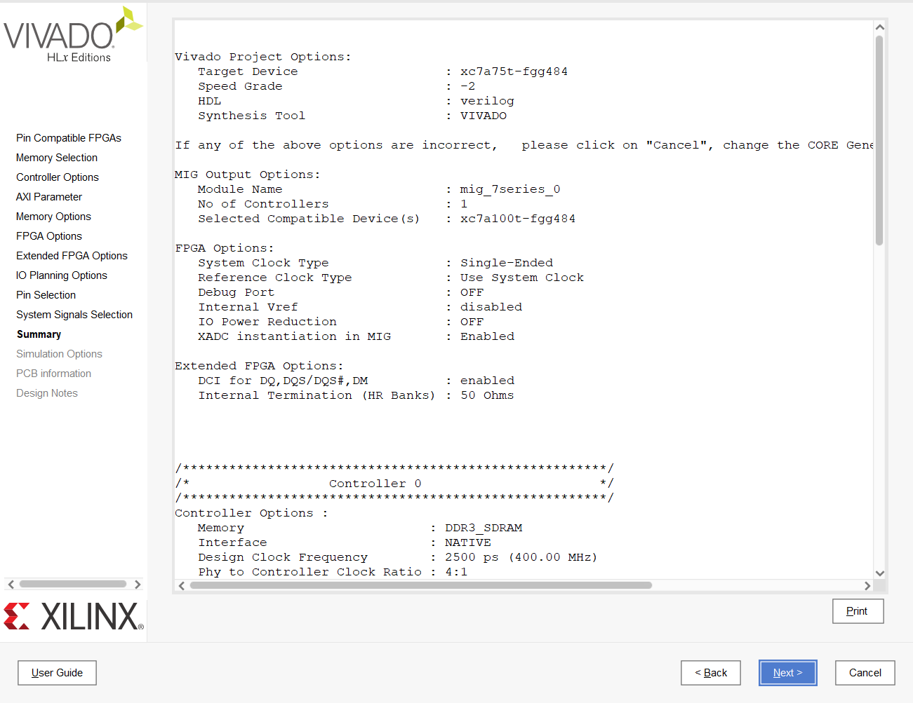

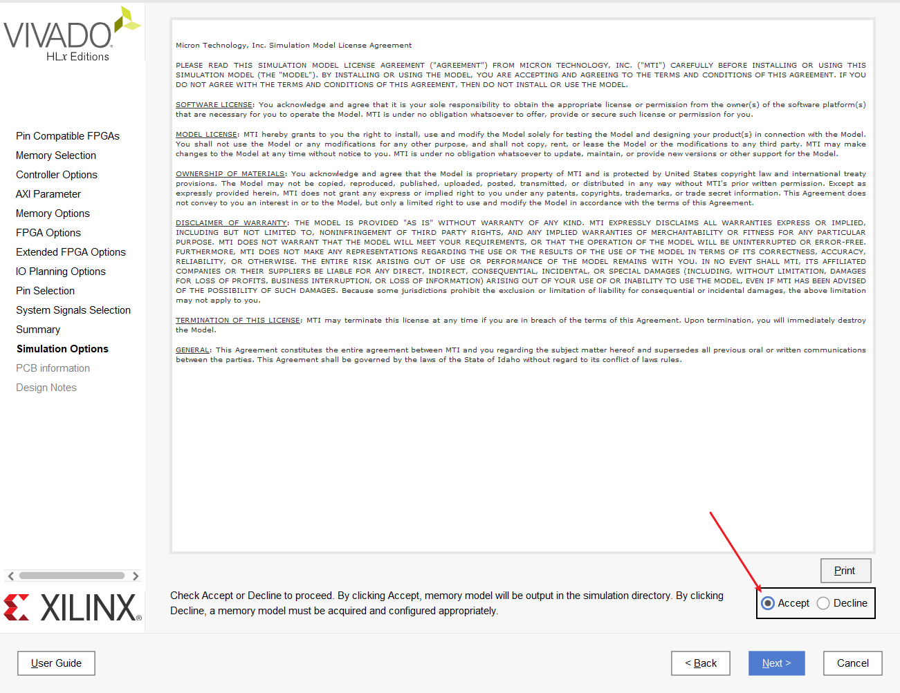

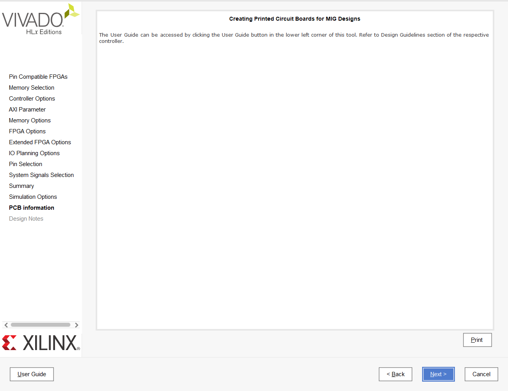

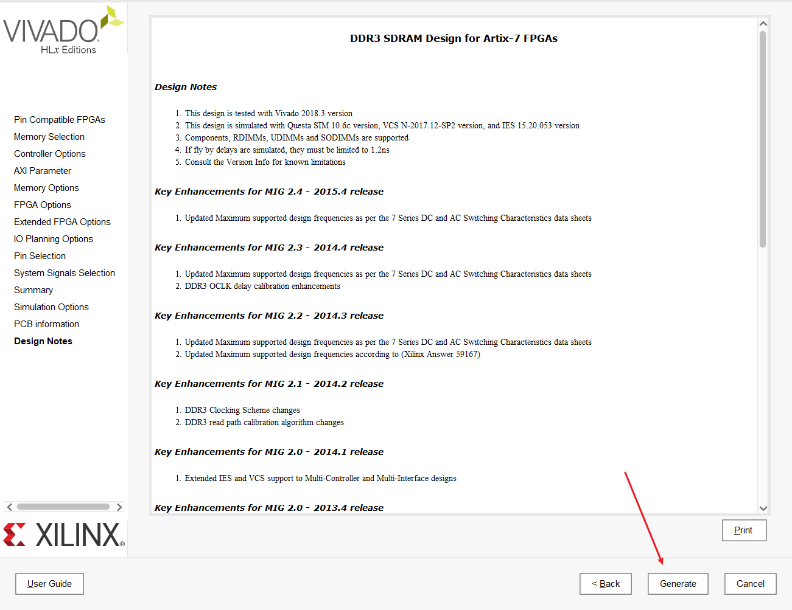

由于不是 BlockDesign 设计的，没有Out of context per Block Design 可以选，故选择 Out of context per IP，generator 来得到综合后的文件。

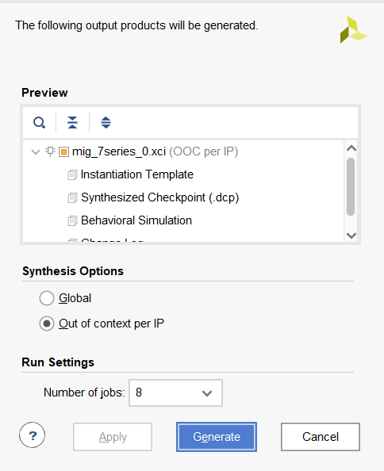

## 生成结果

generator 完，可以发现 IP 的目录下，是有一个黑匣子 stub 文件与 dcp 文件产生的，可以用在 synplify 中（如果有纯 Verilog 设计的部分，可以加速综合）。

具体学习这个 IP 核，可以查看 ug586 的手册，去查看如何使用这些接口。

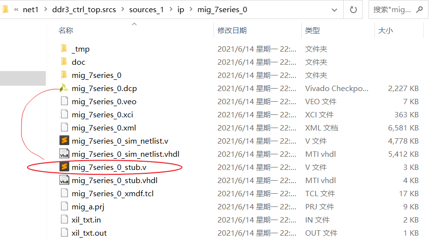
