---

title: 基于Artix7的DDR3 SDRAM IP核初始化
date: 2021-06-15
tag:
    - FPGA
---

## 引子

使用 A7 芯片内自带的 DDR3 SDRAM 的 IP 核的初始化，并通过 modelsim 仿真初始化效果。

在调取 DDR3 SDRAM 控制器之后，并不可以立即使用该 IP 核完成 DDR3 SDRAM 的读和写，而是要在该 IP 核初始化（校准）成功之后，才可以进行读和写的，因此我们完成 A7 DDR3 SDRAM IP 核的初始化是非常有必要的。没有校准成功时，不要进行一个读写的操作。

使用平台：v3学院 EagleGT_REV10 开发板。

使用软件：Vivado2019.2 + ModelSim SE-64 10.5。

## 测试文件书写

### 一、顶层源文件建立

DDR3 SDRAM IP 核生成后，将该 IP 核添加到 Vivado 工程内，添加的 IP 核格式为.xci。这里生成完，已经自动添加了，如果是其他工程，可以添加 IP 路径后，把 IP 加入。

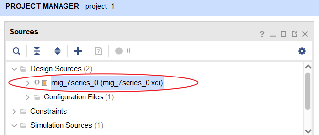

右键 Vivado 中 IP 的 .xci 文件，点击下拉菜单中的 Add source 选项。添加 Design Source 文件，去 Create File 一个新的文件。

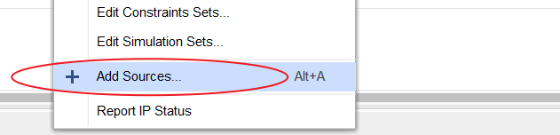

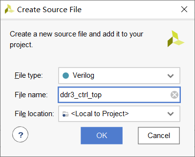

### 二、实例化IP核

在 Vivado 的工程界面内找到并进入 IP Sources 界面，在 IP Sources 界面中找到 ddr3_ctrl.veo（名称根据 IP 核调取时取名不同会不同）文件，双击该文件打开该 IP 核的实例化模板。

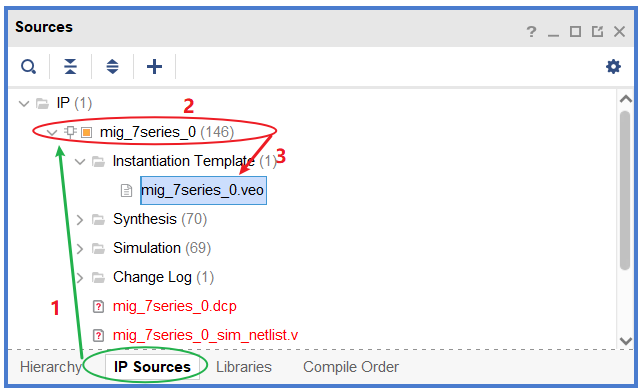

将实例化模板复制到顶层文件，建议需要在顶层模块定义的变量名称与实例化的名称相同，可防止出现名称混淆的情况。

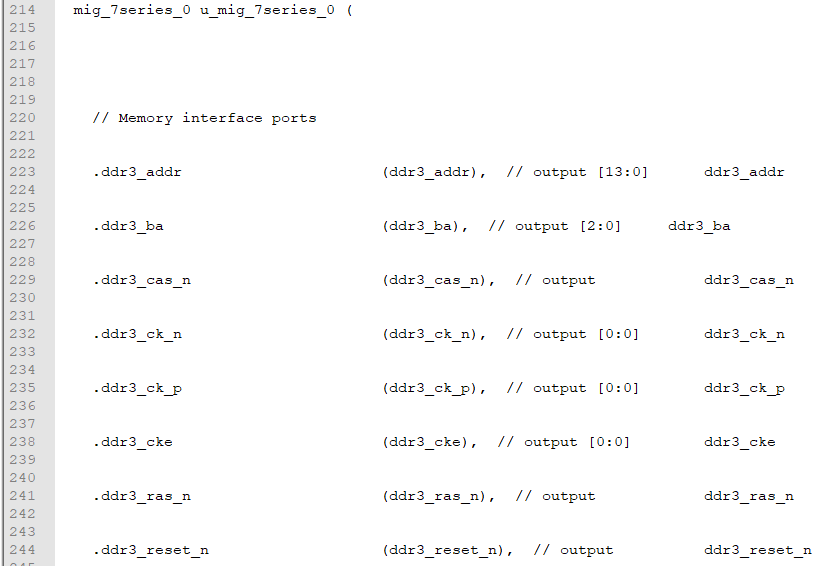

观察实例化模板会发现有一部分信号是以 ddr3 开头的， 此类的信号均为 DDR3 SDRAM 芯片的引脚变量，因此在顶层模块需要将其设置为端口变量，需要将此类信号写入到顶层模块名后面的小括号内，并设定好输入/输出类型，以及变量的位宽。由于例化模板内没有给出这些参考信息，因为我们需要找到一个可供我们参考的例程，下面给出需要参考例程的方案。

调取 IP 核后，会在 Vivado 工程生成一个 .\project_1.srcs\sources_1\ip\mig_7series_0（mig_7series_0 为调取 IP 核的名称）路径，在2018.2版本的 vivado 中，该路径下文件夹内会有三个子文件夹。这里，使用的2019.2版本的，生成的情况如下图。

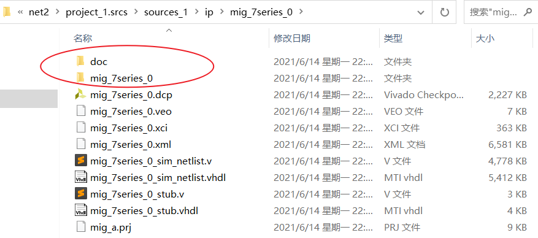

其中，docs 中为该 IP 核相关的文档文件，比如该 IP 核的使用方法等文档都在该文件夹中涉及。example_design 文件夹（2018.2中有）中为 Xilinx 官方提供的该 IP 核参考文件，假如不知道如何使用该 IP 核，可以参考该文件夹内提供的相关例程。user_design 文件夹（2018.2中有，2019.2的放在了 mig_7series_0 中）中为用户可使用的文件，里面包括可综合文件以及约束文件等。

打开 user_design 文件夹，里面有两个子文件夹，constraints 文件夹内为 IP 核的约束文件，rtl 文件夹内为 IP 核的可综合文件。

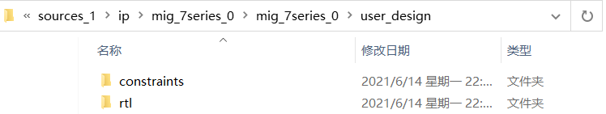

打开 rtl 文件夹，找到与该 IP 核名称相同的 v 文件并打开，会发现该模块的端口也有一部分是以 ddr3 为开头的，将这些类型的 IO 口复制到顶层模块的端口位置，如下所示。另外需要在该端口列表中添加晶振传来的时钟和复位信号，由于 v3 学院开发板的按键是低有效，因此我们复位设置为低有效。

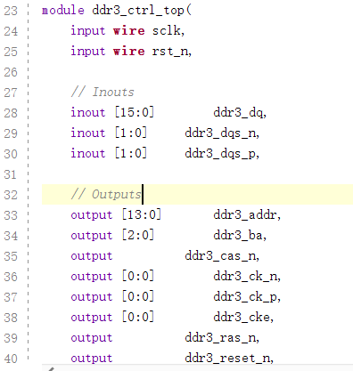

在调取该 IP 核时，选择了对此 IP 核输入一个 200MHz 的时钟， 由于晶振生成的时钟为 50MHz，所以需要通过调取一个 clock 的 IP 核来生成一路 200MHz 的时钟。

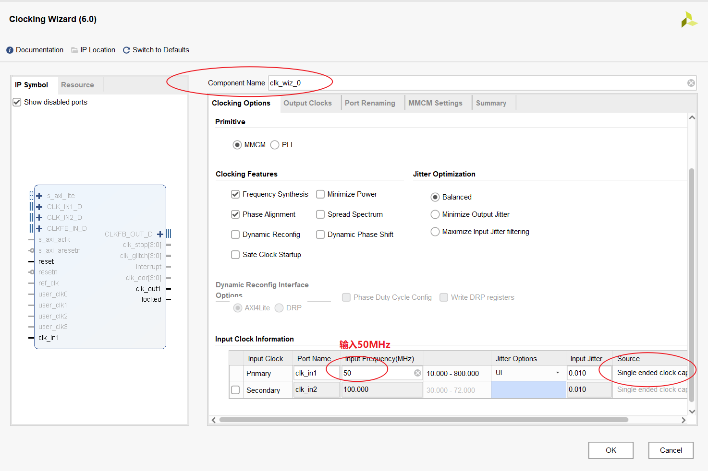

在 Output Clocks 选项中下拉到底，找到 reset 和 locked 勾选项，可以将这两项全部取消。其中，reset 为该 IP 核的输入复位信号，低电平有效。locked 为输出时钟的有效信号，当 locked 信号为高时表示输出时钟有效。

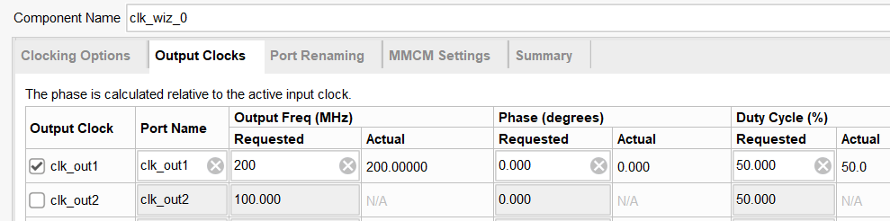

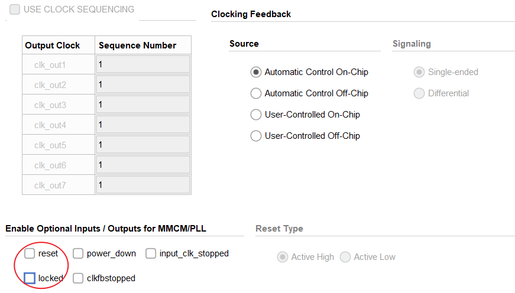

之后点击 OK 生成该 IP 核，按照 DDR3 SDRAM 控制器 IP 核的方式将该 clock IP 核实例化到顶层模块，将该 IP 核输出的 200MHz 时钟与 DDR3 IP 核的输入时钟连接，并把该 IP 核的输入时钟与顶层模块的输入时钟连接。最终将 DDR3 SDRAM 控制器 IP 核的复位端与顶层模块的输入复位信号连接，至此我们 IP 核的实例化结束。具体top层修改后的代码，如下所示：

```verilog
`timescale 1ns / 1ps

module ddr3_ctrl_top( 
    // Inouts
    inout [15:0]		ddr3_dq,
    inout [1:0]		ddr3_dqs_n,
    inout [1:0]		ddr3_dqs_p,
    
    // Outputs
    output [13:0]		ddr3_addr,
    output [2:0]		ddr3_ba,
    output			ddr3_cas_n,
    output [0:0]		ddr3_ck_n,
    output [0:0]		ddr3_ck_p,
    output [0:0]		ddr3_cke,
    output			ddr3_ras_n,
    output			ddr3_reset_n,
    output			ddr3_we_n,

    output [0:0]		ddr3_cs_n,
    output [1:0]		ddr3_dm,
    output [0:0]		ddr3_odt,

    input wire sclkin,
    input wire srst_n
    );
    
wire sysclk;
wire init_calib_complete;
wire ui_clk;
wire ui_clk_sync_rst;

clk_wiz_0 instance_name
   (
    // Clock out ports
    .clk_out1(sysclk),     // output 200MHz
   // Clock in ports
    .clk_in1(sclkin));    // input 50MHz
    
mig_7series_0 u_mig_7series_0 (

    // Memory interface ports
    .ddr3_addr                      (ddr3_addr),  // output [13:0]		ddr3_addr
    .ddr3_ba                        (ddr3_ba),  // output [2:0]		ddr3_ba
    .ddr3_cas_n                     (ddr3_cas_n),  // output			ddr3_cas_n
    .ddr3_ck_n                      (ddr3_ck_n),  // output [0:0]		ddr3_ck_n
    .ddr3_ck_p                      (ddr3_ck_p),  // output [0:0]		ddr3_ck_p
    .ddr3_cke                       (ddr3_cke),  // output [0:0]		ddr3_cke
    .ddr3_ras_n                     (ddr3_ras_n),  // output			ddr3_ras_n
    .ddr3_reset_n                   (ddr3_reset_n),  // output			ddr3_reset_n
    .ddr3_we_n                      (ddr3_we_n),  // output			ddr3_we_n
    .ddr3_dq                        (ddr3_dq),  // inout [15:0]		ddr3_dq
    .ddr3_dqs_n                     (ddr3_dqs_n),  // inout [1:0]		ddr3_dqs_n
    .ddr3_dqs_p                     (ddr3_dqs_p),  // inout [1:0]		ddr3_dqs_p
    .init_calib_complete            (init_calib_complete),  // output			init_calib_complete
      
	.ddr3_cs_n                      (ddr3_cs_n),  // output [0:0]		ddr3_cs_n
    .ddr3_dm                        (ddr3_dm),  // output [1:0]		ddr3_dm
    .ddr3_odt                       (ddr3_odt),  // output [0:0]		ddr3_odt
    // Application interface ports
    .app_addr                       (app_addr),  // input [27:0]		app_addr
    .app_cmd                        (app_cmd),  // input [2:0]		app_cmd
    .app_en                         (1'b0),  // input				app_en
    .app_wdf_data                   (app_wdf_data),  // input [127:0]		app_wdf_data
    .app_wdf_end                    (1'b0),  // input				app_wdf_end
    .app_wdf_wren                   (1'b0),  // input				app_wdf_wren
    .app_rd_data                    (app_rd_data),  // output [127:0]		app_rd_data
    .app_rd_data_end                (app_rd_data_end),  // output			app_rd_data_end
    .app_rd_data_valid              (app_rd_data_valid),  // output			app_rd_data_valid
    .app_rdy                        (app_rdy),  // output			app_rdy
    .app_wdf_rdy                    (app_wdf_rdy),  // output			app_wdf_rdy
    .app_sr_req                     (1'b0),  // input			app_sr_req
    .app_ref_req                    (1'b0),  // input			app_ref_req
    .app_zq_req                     (1'b0),  // input			app_zq_req
    .app_sr_active                  (app_sr_active),  // output			app_sr_active
    .app_ref_ack                    (app_ref_ack),  // output			app_ref_ack
    .app_zq_ack                     (app_zq_ack),  // output			app_zq_ack
    .ui_clk                         (ui_clk),  // output			ui_clk
    .ui_clk_sync_rst                (ui_clk_sync_rst),  // output			ui_clk_sync_rst
    .app_wdf_mask                   (app_wdf_mask),  // input [15:0]		app_wdf_mask
    // System Clock Ports
    .sys_clk_i                       (sysclk),  // input			sys_clk_i
    .sys_rst                        (srst_n) // input sys_rst
    );    
    
endmodule
```

在 generator 时，发现出现问题，原因是 IP 没有添加到工程中，原因是我这个 vivado 工程是直接用 save project as 的方式，去把 net1 保存下来的，IP 的路径环境没有准确识别，因此需要双击，重新 generator 后才可以，正确的是左边有个>箭头的。

init_calib_complete 是初始化并校准成功的标志。app 开头的都是用户程序的接口，仿真的时候，不希望使用到，要把 app 相关的 en 使能与 req 请求等，都置为0。ui_clk 和 ui_clk_sync_rst 是用户时钟和对应同步复位（高有效），按之前配置，这个 ui_clk 是100 MHz 的。不同于sys_clk_i，这个是输入的200 MHz。

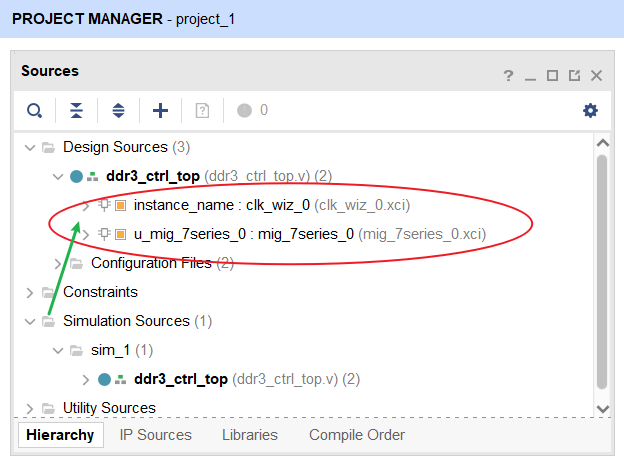

### 三、测试文件的书写

在 Simulation Sources 上右键创建一个仿真的 tb 文件，把 sublime 中得到的一个 sv 仿真模板复制进去。

```verilog
`timescale 1ns/1ps

module tb_top (); /* this is automatically generated */

	// clock
	reg clk;
	reg srst_n;

	// clock
	initial begin
		clk = 0;
		forever #(10) clk = ~clk;
	end

	// reset
	initial begin
		srst_n <= 0;
		#200
		repeat(5)@(posedge clk);
		srst_n <= 1;
	end

	// (*NOTE*) replace reset, clock, others

	wire [15:0] ddr3_dq;
	wire  [1:0] ddr3_dqs_n;
	wire  [1:0] ddr3_dqs_p;
	wire [13:0] ddr3_addr;
	wire  [2:0] ddr3_ba;
	wire        ddr3_cas_n;
	wire  [0:0] ddr3_ck_n;
	wire  [0:0] ddr3_ck_p;
	wire  [0:0] ddr3_cke;
	wire        ddr3_ras_n;
	wire        ddr3_reset_n;
	wire        ddr3_we_n;
	wire  [0:0] ddr3_cs_n;
	wire  [1:0] ddr3_dm;
	wire  [0:0] ddr3_odt;

	ddr3_ctrl_top inst_ddr3_ctrl_top
		(
			.ddr3_dq      (ddr3_dq),
			.ddr3_dqs_n   (ddr3_dqs_n),
			.ddr3_dqs_p   (ddr3_dqs_p),
			.ddr3_addr    (ddr3_addr),
			.ddr3_ba      (ddr3_ba),
			.ddr3_cas_n   (ddr3_cas_n),
			.ddr3_ck_n    (ddr3_ck_n),
			.ddr3_ck_p    (ddr3_ck_p),
			.ddr3_cke     (ddr3_cke),
			.ddr3_ras_n   (ddr3_ras_n),
			.ddr3_reset_n (ddr3_reset_n),
			.ddr3_we_n    (ddr3_we_n),
			.ddr3_cs_n    (ddr3_cs_n),
			.ddr3_dm      (ddr3_dm),
			.ddr3_odt     (ddr3_odt),
			.sclkin       (clk),
			.srst_n       (srst_n)
		);

	ddr3_model u_comp_ddr3
          (
           .rst_n   (ddr3_reset_n),
           .ck      (ddr3_ck_p),
           .ck_n    (ddr3_ck_n),
           .cke     (ddr3_cke),
           .cs_n    (ddr3_cs_n),
           .ras_n   (ddr3_ras_n),
           .cas_n   (ddr3_cas_n),
           .we_n    (ddr3_we_n),
           .dm_tdqs ({ddr3_dm[1],ddr3_dm[0]}),
           .ba      (ddr3_ba),
           .addr    (ddr3_addr),
           .dq      (ddr3_dq[15:0]),
           .dqs     ({ddr3_dqs_p[1],ddr3_dqs_p[0]}),
           .dqs_n   ({ddr3_dqs_n[1],ddr3_dqs_n[0]}),
           .tdqs_n  (),
           .odt     (ddr3_odt)
           );

endmodule
```

仿真模型的话，在官方的 example_design 目录下可以发现 ddr3_model.sv 和 ddr3_model_parameters.vh 文件，这就是和仿真模型有关的。并没有使用这两个文件来对 IP 进行仿真，主要也是因为上手比较麻烦，里面的设计是比较复杂的，故采用自己建立 tb 的方式来完成。

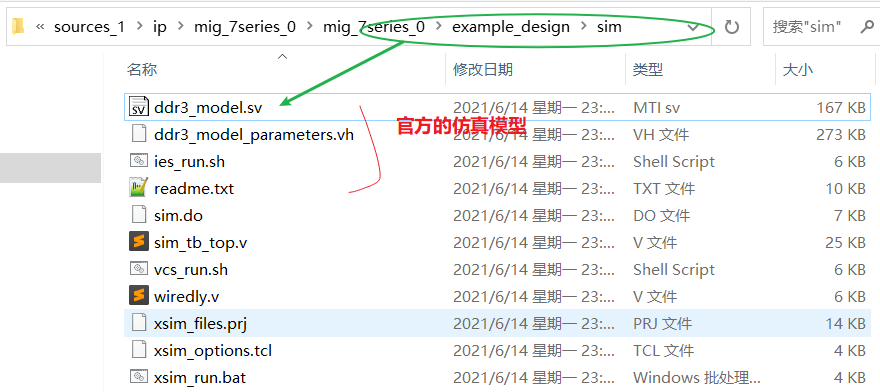

将上述两个文件拷贝到之前新建的 tb 文件的目录下。

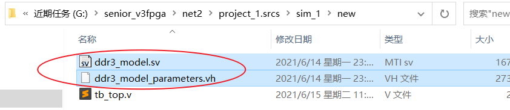

模型的例化，也可以在 example_design 的 sim_tb_top.v 中查看到，直接复制到自己的 tb 下使用。

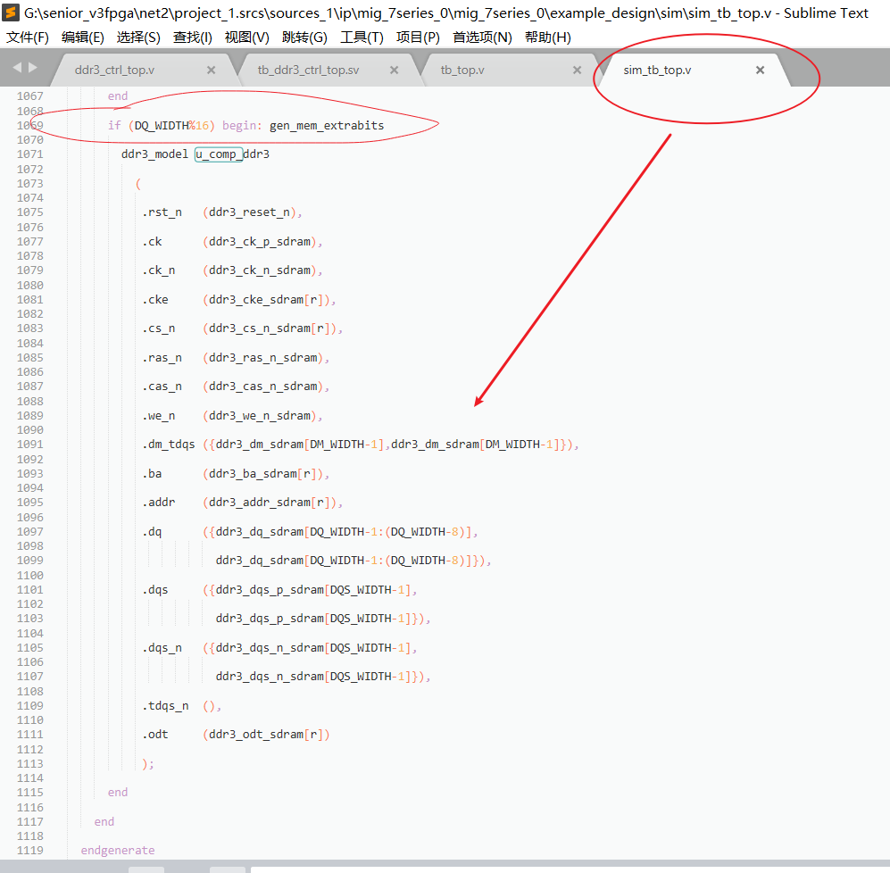

由于使用了仿真模型，需要把对应的 simulation 文件也由 Simulation Sources 加入到工程中去。

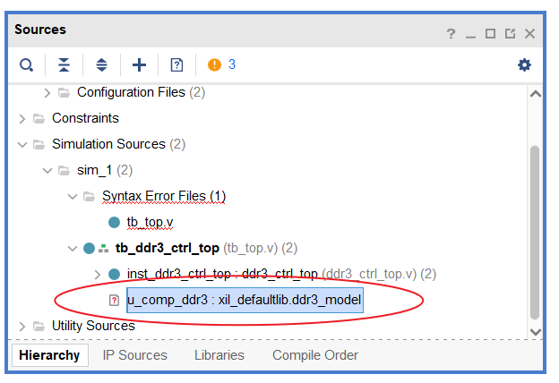

## 仿真

在 vivado2019.2 中启动 modelsim 后，加入相关波形，可以看到 init_calib_complete 信号变高，证明软件上模拟 ddr 的初始化，已经是成功的了。

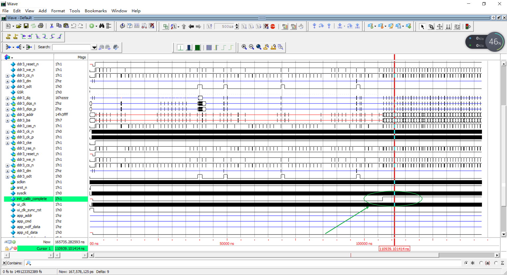
