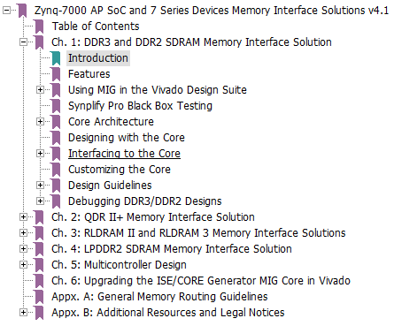
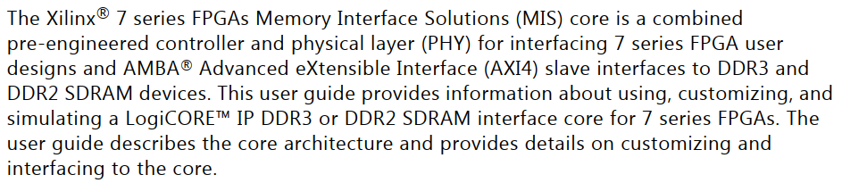
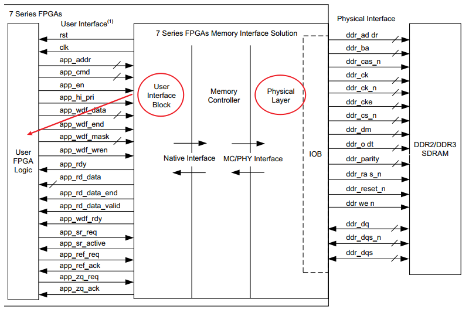
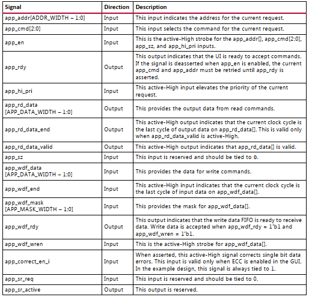
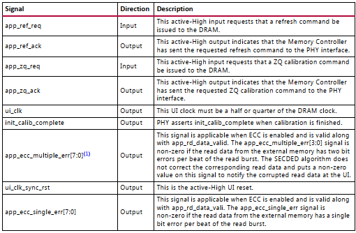
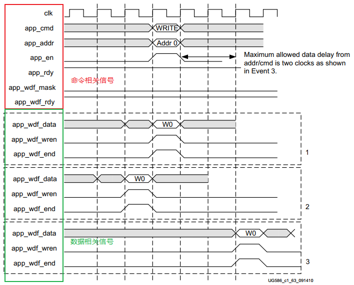
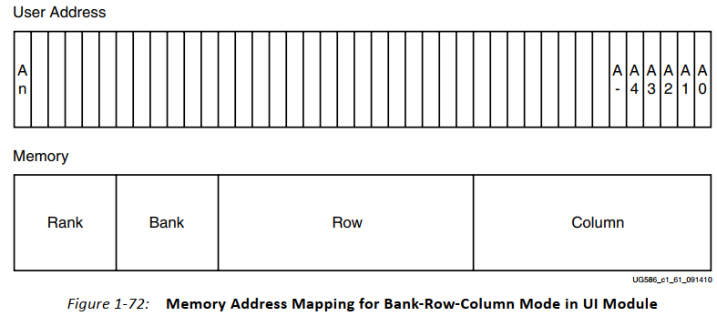

---

title: 基于Artix7的DDR3 IP写时序实现（一）
date: 2021-06-15
tag:
    - FPGA
    - DDR
---

## 前言

所有的东西，都是参考 ug586 官方手册整理的。更详细的内容，可以参考那部分手册去了解。下图是手册的目录，由于使用的是 DDR 控制器，所以只需关注 DDR3 and DDR2 SDRAM Memory Interface Solution 部分。

## 介绍

一个组合预制的控制器和物理层，将用户设计接口或 AXI4 Slave 接口与 DDR3 或 DDR2 进行连接。

Xilinx 7系列FPGA内存接口解决方案对早期内存接口解决方案设备系列的增强功能包括：

- 更高的性能。
- 物理层中使用的新硬件块：移相器输入和移相器输出、PHY控制块和 I/O FIFO（参见第90页的核心架构）。
- 引脚规则因硬件块而改变（见第192页设计指南）。
- 控制器和用户接口以内存时钟频率的1/4工作。 

核结构如下：

## 用户接口

相关信号，可以分层两组：

信号的方向与说明：

|信号|方向|说明|
|---|---|---|
|app_addr[ADDR_WIDTH - 1]|输入|当前请求的地址|
|app_cmd[2:0]|输入|命令请求是何种类型，001是读，000是写|
|app_en|输入|高有效，指示app_addr[]，app_cmd[2:0]，app_sz 和 app_hi_pri输入都有效|
|app_rdy|输出|指示user interface准备接收命令|
|app_hi_pri|输入|与请求事件优先级有关|
|app_rd_data[APP_DATA_WIDTH - 1]|输出|读出信号|
|app_rd_data_end|输出|读取的最后一个突发标志|
|app_rd_data_valid|输出|读出数据的有效|
|app_sz|输入|保留位，为0|
|app_wdf_data[APP_DATA_WIDTH - 1]|输入|写入信号|
|app_wdf_end|输入|信号为高，表示当前数据是突发的最后一个|
|app_wdf_mask[APP_MASK_WIDTH - 1:0]|输入|为1的话，写入数据被掩码掩掉，不会写入内存中，一个MASK的bit控制一个DATA的bit|
|app_wdf_rdy|输出|数据准备好，在app_wdf_wren为1的时候，将其拉高|
|app_wdf_wren|输入|写使能，表示准备往IP核里写数据|
|app_correct_en_i|输入|---|
|app_sr_req|输入|---|
|app_sr_active|输出|---|
|app_ref_req|输入|---|
|app_ref_ack|输出|---|
|app_zq_req|输入|---|
|app_zq_ack|输出|---|
|ui_clk|输出|---|
|init_calib_complete|输出|---|
|app_ecc_multiple_err[7:0]|输出|---|
|ui_clk_sync_rst|输出|---|
|app_ecc_single_err[7:0]|输出|---|

地址往往是学习 IP 的难点，AXI DMA 的时候是字节地址，这里的 app_addr 并不是字节地址。在 Summary 中有 Burst Length = 8 的信息，是没法配置的，需要知道。

从模块例化的信息，可以发现，app_wdf_data的位宽为突发长度8 x 数据位宽APP_DATA_WIDTH，也就是说一次突发就把所有数据给写进去了，即是首次突发，也是最后一次突发，这里即 app_wdf_wren 和 app_wdf_end 其实是一样的，如果把 app_wdf_data 的位宽改成4 x 数据位宽APP_DATA_WIDTH，那么想完成8次突发的数据量的话，就得两个时钟周期去传数据，这样 app_wdf_wren 和 app_wdf_end 就是不一样的。

## 内存地址

地址和内存的映射是一一对应的。app_addr 不是字节地址，是 DDR 的内存地址，内存地址存放的是16位的数据。我们一次写入的数据是128位宽的（8x16），那一次写入该增加的内存地址是多少？按前面所说，一个地址存放16为数据，128/16为8，也就是一次写入完，地址得偏移8个。

## 其他内容

Command Path、Write Path、Read Path、4:1关系与2:1关系。
