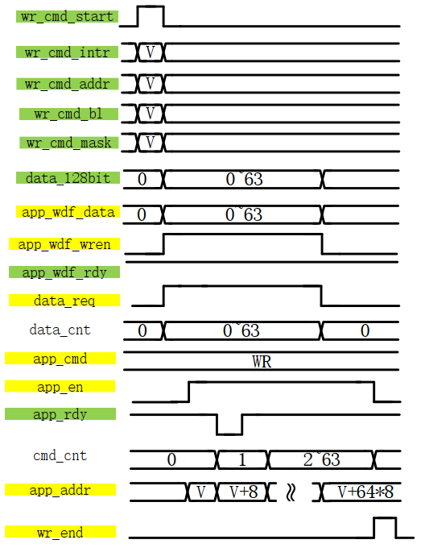
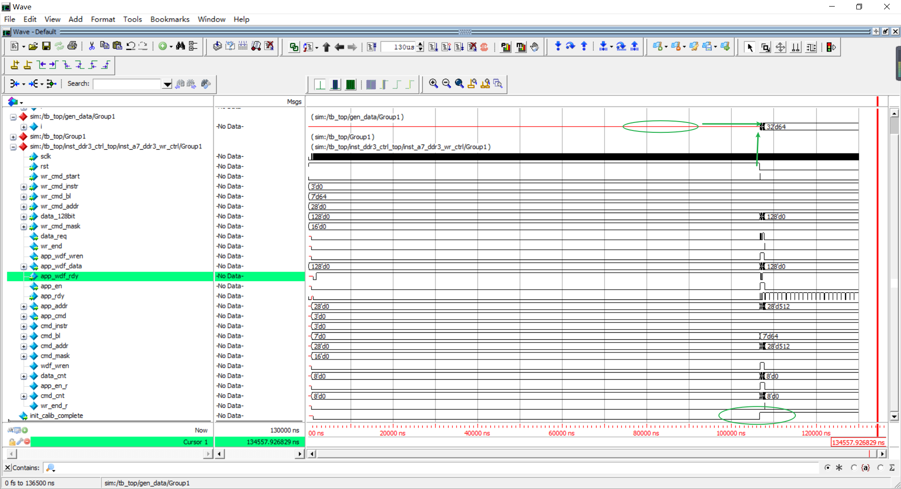
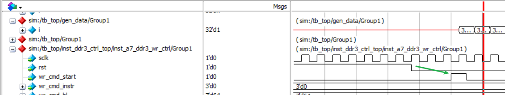
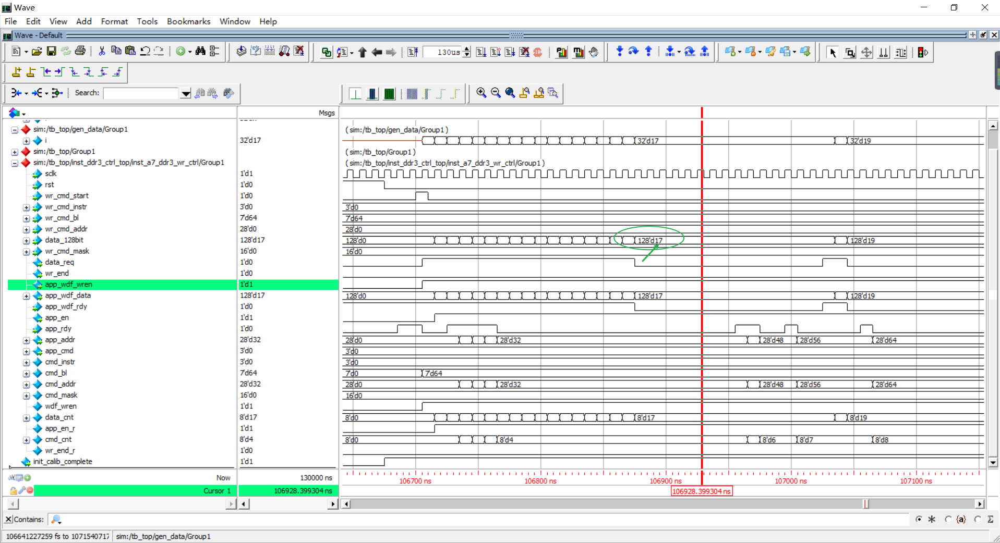
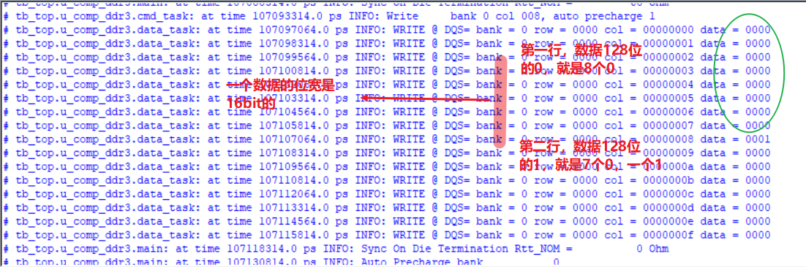
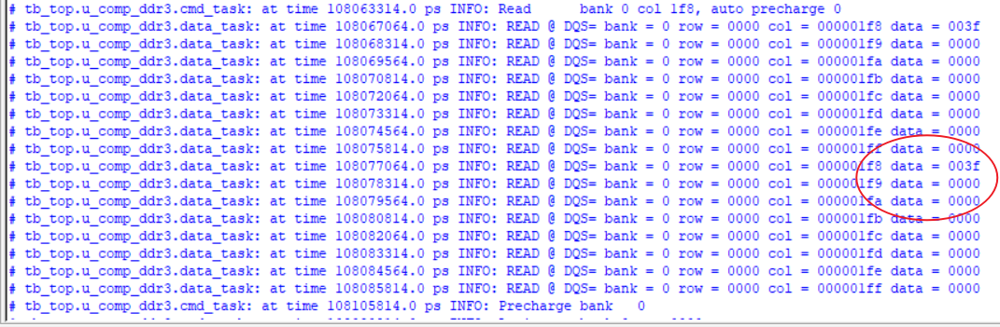
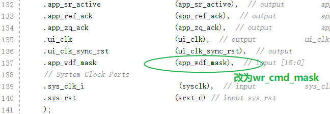

---

title: 基于Artix7的DDR3 IP写时序实现（二）
date: 2021-06-17
tag:
    - FPGA
    - DDR
---

## 代码设计

```verilog
`timescale 1ns / 1ps

module a7_ddr3_wr_ctrl(
    
    input   wire            sclk,
    input   wire            rst,
    //user write ports
    input   wire            wr_cmd_start,
    input   wire    [2:0]   wr_cmd_instr,
    input   wire    [6:0]   wr_cmd_bl,
    input   wire    [27:0]  wr_cmd_addr,
    input   wire    [127:0] data_128bit,
    input   wire    [15:0]  wr_cmd_mask,
    output  wire            data_req,
    output  wire            wr_end,
    //ddr3 ipcore ports
    output  wire            app_wdf_wren,
    output  wire    [127:0] app_wdf_data,
    input   wire            app_wdf_rdy,
    output  wire            app_en,
    input   wire            app_rdy,
    output  wire    [27:0]  app_addr,
    output  wire    [2:0]   app_cmd

    );

    // 将输入的一些数据缓存下来
    // app_wdf_data不用进行缓存
    // cmd_instr、cmd_bl和cmd_mask都是不变的，可以一个always中缓存
    // cmd_addr是不断接收更新的，不放在一个always中
    reg [2:0]   cmd_instr;  // 命令的缓存变量
    reg [6:0]   cmd_bl;     // 突发长度的缓存变量
    reg [27:0]  cmd_addr;   // 地址的缓存变量
    reg [15:0]  cmd_mask;   // 掩码的缓存变量
    
    reg         wdf_wren;   // app_wdf_wren赋值前变量
    reg [7:0]   data_cnt;   // burst的计数器变量
    reg         app_en_r;   // app_en需要错后一拍
    reg [7:0]   cmd_cnt;    // 对输入命令的计数
    reg         wr_end_r;   // cmd结束的时候，才产生的

    assign wr_end = wr_end_r;
    assign app_wdf_wren = wdf_wren;
    assign app_en = app_en_r;
    assign app_addr = cmd_addr;
    assign app_cmd = cmd_instr;

    // 使用一个sclk，来将固定的cmd_instr、cmd_bl和cmd_mask进行缓存
    always @(posedge sclk) begin
        if(rst == 1'b1) begin
            cmd_instr <= 'd0;
            cmd_bl <= 'd0;
            cmd_mask <= 'd0;
        end
        else if(wr_cmd_start == 1'b1) begin
            cmd_instr <= wr_cmd_instr;
            cmd_bl <= wr_cmd_bl;
            cmd_mask <= wr_cmd_mask;
        end
    end

    // 写命令开始信号wr_cmd_start拉高时，将写数据使能wdf_wren拉高
    // wr_cmd_start为高后与wdf_wren为高，有一个时钟的间隔
    // 得&上app_wdf_rdy，是两个都为1时才进行拉低
    always @(posedge sclk) begin
        if (rst == 1'b1) begin
            wdf_wren <= 1'b0;
        end
        else if (wdf_wren == 1'b1 && data_cnt == (cmd_bl-1) && app_wdf_rdy == 1'b1) begin
            wdf_wren <= 1'b0;
        end
        else if (wr_cmd_start == 1'b1) begin
            wdf_wren <= 1'b1;
        end
    end

    // 最后一个数据的时候，拉低
    always @(posedge sclk) begin
        if (rst == 1'b1) begin
            data_cnt <= 'd0;
        end
        else if (data_cnt ==  (cmd_bl-1) && data_req == 1'b1) begin
            data_cnt <= 'd0;
        end
        else if (data_req == 1'b1) begin
            data_cnt <= data_cnt + 1'b1;
        end
    end

    // 数据和使能都有了
    // 都为1的时候，才去请求数据。
    assign data_req = wdf_wren & app_wdf_rdy;
    // 直接把data_128bit数据给app_wdf_data
    assign app_wdf_data = data_128bit;

    // app_en_r拉高相对data_req延后一拍
    always @(posedge sclk) begin
        if (rst == 1'b1) begin
            app_en_r <= 1'b0;
        end
        else if (app_en_r == 1'b1 && app_rdy == 1'b1 && cmd_cnt == (cmd_bl-1)) begin
            app_en_r <= 1'b0;
        end
        else if (data_req == 1'b1) begin
            app_en_r <= 1'b1;
        end
    end

    // 最后一个数据，将cmd_cnt拉低
    always @(posedge sclk) begin
        if (rst == 1'b1) begin
            cmd_cnt <='d0;
        end
        else if (cmd_cnt ==  (cmd_bl-1) && app_rdy == 1'b1 && app_en_r == 1'b1)begin
            cmd_cnt <= 'd0;
        end
        else if (app_en_r == 1'b1 && app_rdy == 1'b1) begin
            cmd_cnt <= cmd_cnt + 1'b1;
        end
    end

    // wr_cmd_start为1的时候，进行赋值。其他情况下，需要+8
    // 128/16=8个，一次8个地址的突发
    always @(posedge sclk) begin
        if (rst == 1'b1) begin
            cmd_addr <= 'd0;
        end
        else if (app_rdy == 1'b1 && app_en_r == 1'b1) begin
            cmd_addr <= cmd_addr + 'd8;
        end
        else if (wr_cmd_start == 1'b1) begin
            cmd_addr <= wr_cmd_addr;
        end
    end
    
    // 就是cmd变成0的条件，产生一个wr_end_r为1的一个时钟周期标志
    always @(posedge sclk) begin
        if (rst == 1'b1) begin
            wr_end_r <='d0;
        end
        else if (cmd_cnt ==  (cmd_bl-1) && app_rdy == 1'b1 && app_en_r == 1'b1) begin
            wr_end_r <=1'b1;
        end
        else begin
            wr_end_r <= 1'b0;
        end
    end

endmodule
```

## 相关时序



## 仿真模块

```verilog
`timescale 1ns/1ps

module tb_top (); /* this is automatically generated */

	// clock
	reg clk;
	reg srst_n;
	// FOR SIM 
    reg sclk;
    reg rst;
    reg data_req;
    reg wr_cmd_start;
    reg [2:0]   wr_cmd_instr;
    reg [27:0]  wr_cmd_addr;
    reg [6:0]   wr_cmd_bl;
    reg [15:0]  wr_cmd_mask;
    reg [127:0]	data_128bit;
    
    initial begin
        wr_cmd_start = 0;
        wr_cmd_instr = 0;
        wr_cmd_addr  = 0;
        wr_cmd_mask  = 0;
        wr_cmd_bl    = 64;
        data_128bit  = 0;
    // 使用force强制赋值
        force sclk = inst_ddr3_ctrl_top.inst_a7_ddr3_wr_ctrl.sclk;
        force rst  = inst_ddr3_ctrl_top.inst_a7_ddr3_wr_ctrl.rst;
        force data_req = inst_ddr3_ctrl_top.inst_a7_ddr3_wr_ctrl.data_req;
        force inst_ddr3_ctrl_top.wr_cmd_start=wr_cmd_start;
        force inst_ddr3_ctrl_top.wr_cmd_instr=wr_cmd_instr;
        force inst_ddr3_ctrl_top.wr_cmd_addr=wr_cmd_addr;
        force inst_ddr3_ctrl_top.wr_cmd_mask=wr_cmd_mask;
        force inst_ddr3_ctrl_top.wr_cmd_bl=wr_cmd_bl;
        force inst_ddr3_ctrl_top.data_128bit=data_128bit;
    end

	initial begin
		#100
		// 满足条件才运行，有阻塞条件
		gen_cmd();
	end

	initial begin
		#100
		// 满足条件才运行，有阻塞条件
		gen_data();
	end

    task gen_cmd;
        integer i;
        begin
            @(negedge rst); // 检测下降沿
            @(negedge sclk);
            @(negedge sclk);
            @(negedge sclk);
            // 三个时钟周期后，对控制信号操作
            wr_cmd_start=1;
            @(negedge sclk);
            wr_cmd_start=0;
        end
    endtask
    
	task gen_data;
		integer i;
		begin
			@(posedge data_req);
            // 完成64个数据的写入后，才会退出
			for(i =0; i<64;i=i+1) begin
				data_128bit = {96'd0,i[31:0]};
				@(posedge sclk);
                // 判断data_req的条件，为低的话，就减一个，i会保持不变
				if(data_req == 1'b0) begin
					i = i -1;
				end
			end
            // 数据写完后，先立即清理
			data_128bit =0;
			@(posedge sclk);
		end
	endtask

	// clock
	initial begin
		clk = 0;
		forever #(10) clk = ~clk;
	end

	// reset
	initial begin
		srst_n <= 0;
		#200
		repeat(5)@(posedge clk);
		srst_n <= 1;
	end

	// (*NOTE*) replace reset, clock, others

	wire [15:0] ddr3_dq;
	wire  [1:0] ddr3_dqs_n;
	wire  [1:0] ddr3_dqs_p;
	wire [13:0] ddr3_addr;
	wire  [2:0] ddr3_ba;
	wire        ddr3_cas_n;
	wire  [0:0] ddr3_ck_n;
	wire  [0:0] ddr3_ck_p;
	wire  [0:0] ddr3_cke;
	wire        ddr3_ras_n;
	wire        ddr3_reset_n;
	wire        ddr3_we_n;
	wire  [0:0] ddr3_cs_n;
	wire  [1:0] ddr3_dm;
	wire  [0:0] ddr3_odt;

	ddr3_ctrl_top inst_ddr3_ctrl_top
		(
			.ddr3_dq      (ddr3_dq),
			.ddr3_dqs_n   (ddr3_dqs_n),
			.ddr3_dqs_p   (ddr3_dqs_p),
			.ddr3_addr    (ddr3_addr),
			.ddr3_ba      (ddr3_ba),
			.ddr3_cas_n   (ddr3_cas_n),
			.ddr3_ck_n    (ddr3_ck_n),
			.ddr3_ck_p    (ddr3_ck_p),
			.ddr3_cke     (ddr3_cke),
			.ddr3_ras_n   (ddr3_ras_n),
			.ddr3_reset_n (ddr3_reset_n),
			.ddr3_we_n    (ddr3_we_n),
			.ddr3_cs_n    (ddr3_cs_n),
			.ddr3_dm      (ddr3_dm),
			.ddr3_odt     (ddr3_odt),
			.sclkin       (clk),
			.srst_n       (srst_n)
		);

	ddr3_model u_comp_ddr3
          (
           .rst_n   (ddr3_reset_n),
           .ck      (ddr3_ck_p),
           .ck_n    (ddr3_ck_n),
           .cke     (ddr3_cke),
           .cs_n    (ddr3_cs_n),
           .ras_n   (ddr3_ras_n),
           .cas_n   (ddr3_cas_n),
           .we_n    (ddr3_we_n),
           .dm_tdqs ({ddr3_dm[1],ddr3_dm[0]}),
           .ba      (ddr3_ba),
           .addr    (ddr3_addr),
           .dq      (ddr3_dq[15:0]),
           .dqs     ({ddr3_dqs_p[1],ddr3_dqs_p[0]}),
           .dqs_n   ({ddr3_dqs_n[1],ddr3_dqs_n[0]}),
           .tdqs_n  (),
           .odt     (ddr3_odt)
           );

endmodule
```

## 仿真分析



rst 信号有效时，gen_data task 模块一直是高阻态，并没进行赋值。



rst 信号为低后，过几个时钟周期，产生 start 信号。



data_req 拉低后，数据保持不变。





Modelsim 地址写入数据的测试打印，最后数据停在了 3f 上，就是 63，是和输入对应的。

## 其他补充

使用 force 命令连接子模块信号时，发现有时在 tb_top 并未准确显示 task 的模块，反复试了几次无果。最后，把 project_1.sim/sim_1/behav/modelsim 的仿真记录删除后，可以正确显示。因此，确定是 net2 工程直接复制带来的缓存记录导致的错误。

u_mig_7series_0 模块里的 mask 信号需要改为控制器输入的 mask 不然掩码，导致无法正确地写入。


