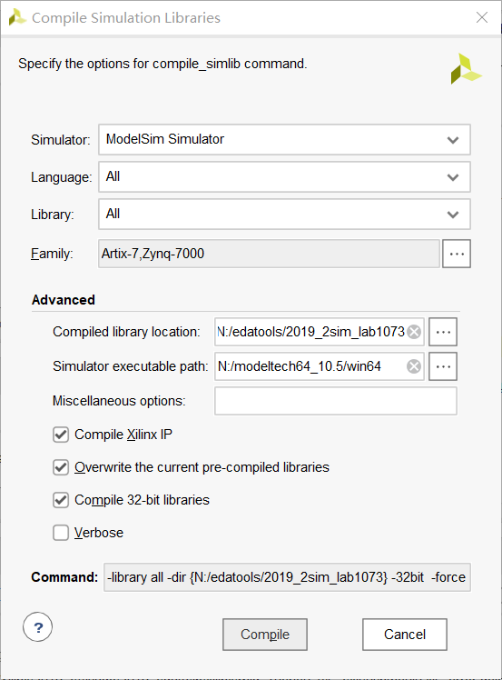
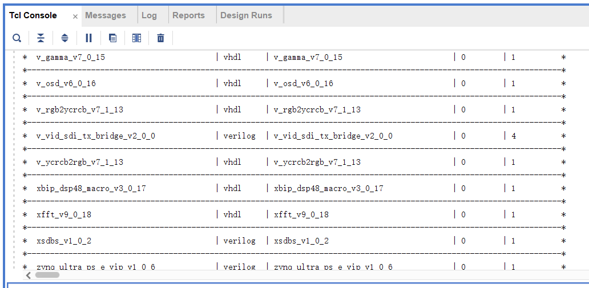
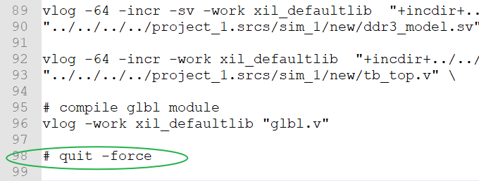
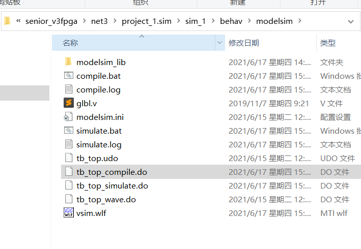

---

title: 高级班中学到的一些有用的tips

tag:
    - FPGA
---

## 更改vivado默认编辑器

在settings图标内，点 Text Editor，选择 Custom Editor，加入下面指令修改。

```vhdl
C:\Program Files\Sublime Text 3\sublime_text.exe [file name]:[line number]
```

## MMCM与PLL的小区别

MMCM 比 PLL支持的特性更加多些，增加了一些数字方面的设计，一般场合下，两个都是适用的。

## 大量行的列编辑模式

在 sublime 中，可以使用**shift + 鼠标右键**的方式，一次性的对多行进行列的编辑。如果想选中多行中的某些字符，可以在该基础上，将点击后的右键进行拖动选中。或者，直接再按**shift + → or ←**的方式，进行框选。

## IP核仿真与学习途径

在 Xilinx IP 的**example_design**路径，会有一些示例，多数情况下，可以基于这些东西做些工作。

## vivado2019.2中联合Modelsim

之前在2018.2中我已经做过类似的工作，并把最后编译的库放在了C:/edatools/sim_lab1073。这里，由于使用了2019.2版本的，因此重新走一遍并简要的记录下。



新的编译库，存放的路径在`N:\edatools\2019_2sim_lab1073`中。本来，直接使用 vivado 自带的一些仿真工具，也是可以的，但 Modelsim 相较于其，会快很多。



## DocNav中的DS、UG与获取

Datasheet是用于绘制原理图的，Userguide才是真正讲如何使用的。

Xilinx 的官方手册可以使用三种方式获取，具体记录下来：

- IP 核的 Document 文件夹中。
- DocNav 软件中直接搜索获取。
- 官方的 user guide 网站：<https://www.xilinx.com/search/site-keyword-search.html#q=ug586>。直接官方搜索下载

## 一些单次的翻译

solutions —— 方案

## 端口信号全wire风格

端口上的 input 和 output 信号可以全部定义为wire型，利用中间的 reg 变量，对时序设计完，再用 assign 赋值出来。

## force 连接模块信号

在 tb 文件中，一些模块内部定义的中间变量，在设计 testbench 时，可以使用 force 将子模块信号连接到外部。

## 脚本更改不退出并仿真

在 vivado 工程中，有一个 compile 相关的文件 tb_top_compile.do，打开该文件，将最后的 quit -force 给注释掉。之后使用 do tb_top_compile.do 指令和 do tb_top_simulate.do 指令，就可以不关闭 Modelsim，重新进行编译和仿真，而不需要再去 vivado 中点击仿真。




