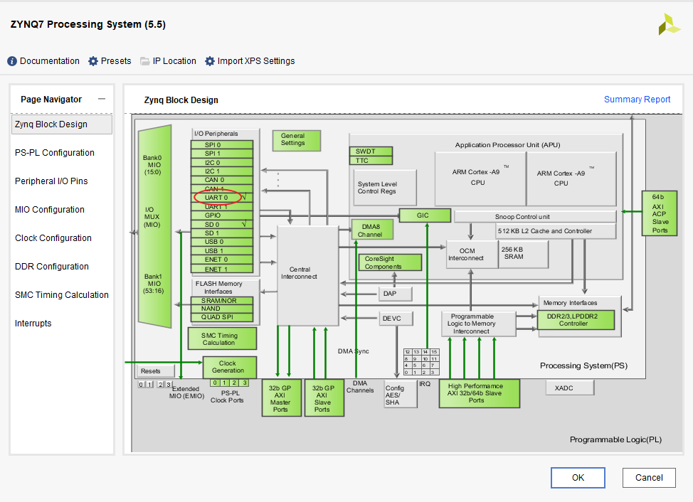
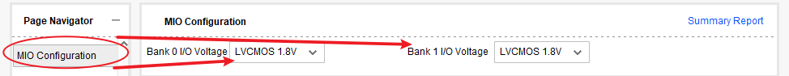
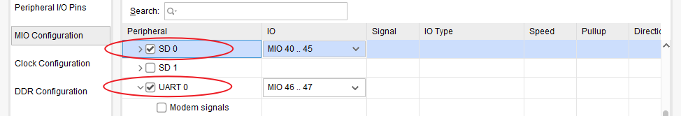
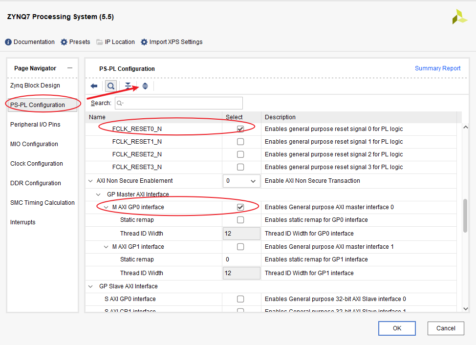
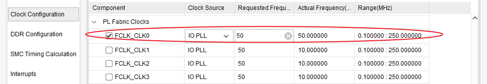
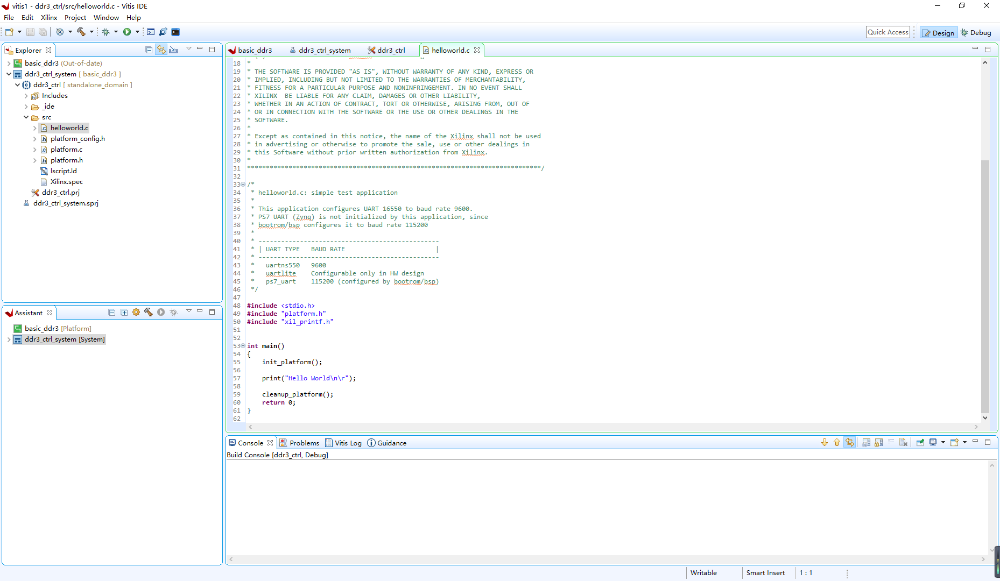
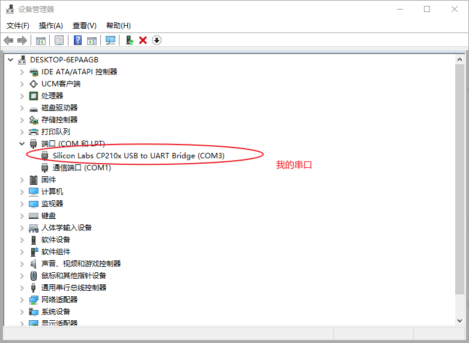
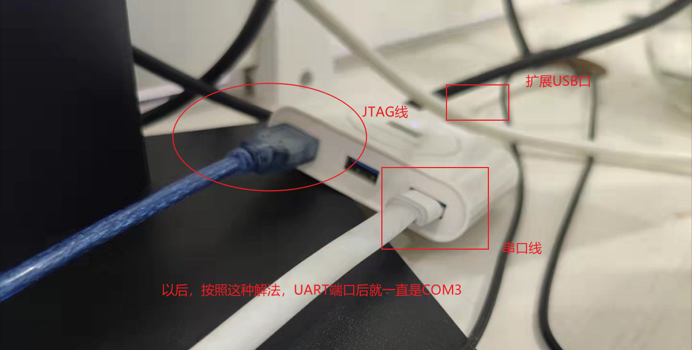
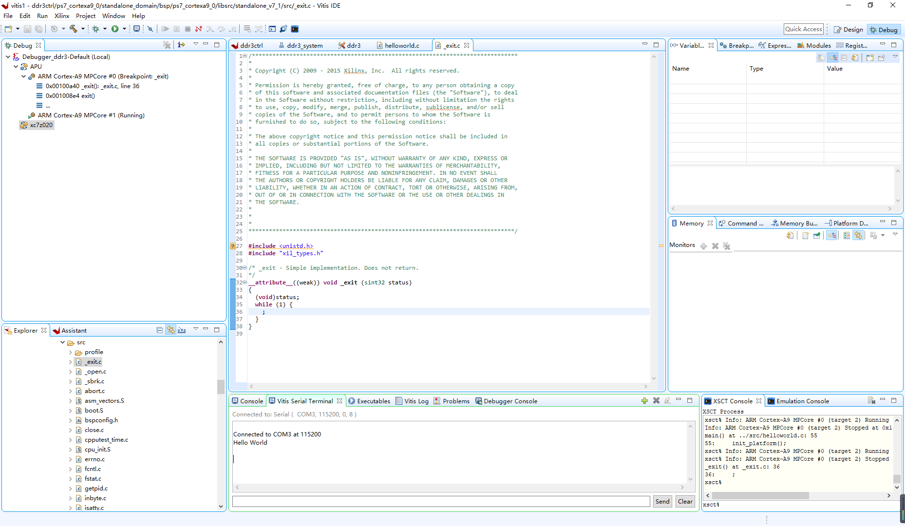
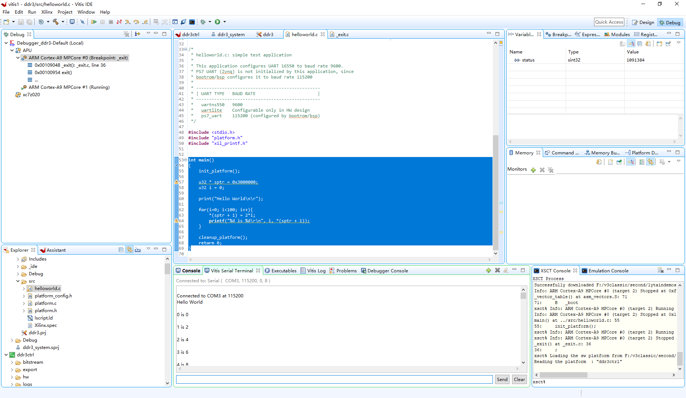

## Zynq开发板

来源：V3学院中级班开发板
型号：xc7z020clg400-1

### 基本工程1——DDR配置

基本工程标准：电平标准LVC18、UART0、SD0、FRST0、GP0、FCLK0和DDR3 Controller。

基本工程下载：[基本工程V192_20211009](https://lytain.lanzoui.com/iL7Fpv40byf)、[基本工程V192_20211009_DDR3写读](https://lytain.lanzoui.com/isWniv40wif)

实验中下载的：[串口驱动CP210x USB to UART Bridge VCP Drivers](https://lytain.lanzoui.com/iC5Tav3zgsd)

基本工程思路：

添加Zynq后，双击进入配置界面，配置界面中点击UART0，可以进入MIO Configuration界面。



进入MIO Configuration界面下，将Bank0和Bank1的IO Voltage的标准都设置成LVCMOS1.8。



接着，勾选SD0和UART0端口，并进行管脚编号，类似于管脚绑定，这里其实是ARM端对SD0和UART0的管脚做了PS端的约束。这里，需要绑定的UART0管脚为MIO46、47，SD0管脚为MIO40~45。



点击PS-PL Configuration并展开，这里我勾选了一个复位信号FCLK_RESET0_N与一个GP0口，这两个东西，可以去掉也可以保留，问题不大，我这里都取消掉，主要是为了搭建基本工程，如果需要挂接AXI模块，可以后面打开。



点击Clock Configuration并展开，这里有一个FCLK_CLK0，用于给外部模块提供一个时钟，同样关闭掉。



最后，关于DDR部分的配置，参数恒定为下面这样。

```
DDR Controller Configuration
    Memory Type                :    DDR3
    Memory Part                :    Custom
    Effective DRAM Bus Width   :    32Bit
    ECC                        :    Disabled
    Burst Length               :    8
    DDR                        :    533.333333
    Internal Vref              :    None
    Juntion Temperature(C)     :    Normal
Memory Part Configuration
    DRAM IC Bus Width          :    16Bits
    DRAM Device Capacity       :    2048MBits
    Speed Bin                  :    DDR3 1066F
    Bank Address Count(Bits)   :    3
    Row Address Count(Bits)    :    14
    Col Address Count(Bits)    :    10
    CAS Latency(cycles)        :    7
    CAS Write Latency(cycles)  :    6
    RAS to CAS Delay(cycles)   :    7
    Precharge Time(cycles)     :    7
    tRC(ns)                    :    49
    tRASmin(ns)                :    36
    tFAW(ns)                   :    25
```
一般可能需要配置的，有如下几个参数：
```
DDR Controller Configuration
    Memory Part                :    Custom
Memory Part Configuration
    DRAM IC Bus Width          :    16Bits
    Bank Address Count(Bits)   :    3
    Row Address Count(Bits)    :    14
    Col Address Count(Bits)    :    10
    CAS Latency(cycles)        :    7
    CAS Write Latency(cycles)  :    6
    RAS to CAS Delay(cycles)   :    7
    Precharge Time(cycles)     :    7
    tRC(ns)                    :    49
    tRASmin(ns)                :    36
    tFAW(ns)                   :    25
```
OK，配置完，即可生成wrapper，综合实现，并用Vitis进行测试。基本Vitis工程如下。



首先，测试能不能用串口打印出“HelloWorld”信息。可能需要安装驱动，驱动程序已经放在最上面了。安装后显示如下。



后续Zynq板卡的连线，我是比较固定的，这样不用再去看COM端口号。



烧录程序，连接串口测试，OK！



测试DDR3的读写是否正确。代码如下：

```
int main()
{
    init_platform();

    u32 * sptr = 0x3000000;
    u32 i = 0;

    print("Hello World\n\r");

    for(i=0; i<100; i++){
    	*(sptr + 1) = 2*i;
    	printf("%d is %d\r\n", i, *(sptr + 1));
    }

    cleanup_platform();
    return 0;
}
```



